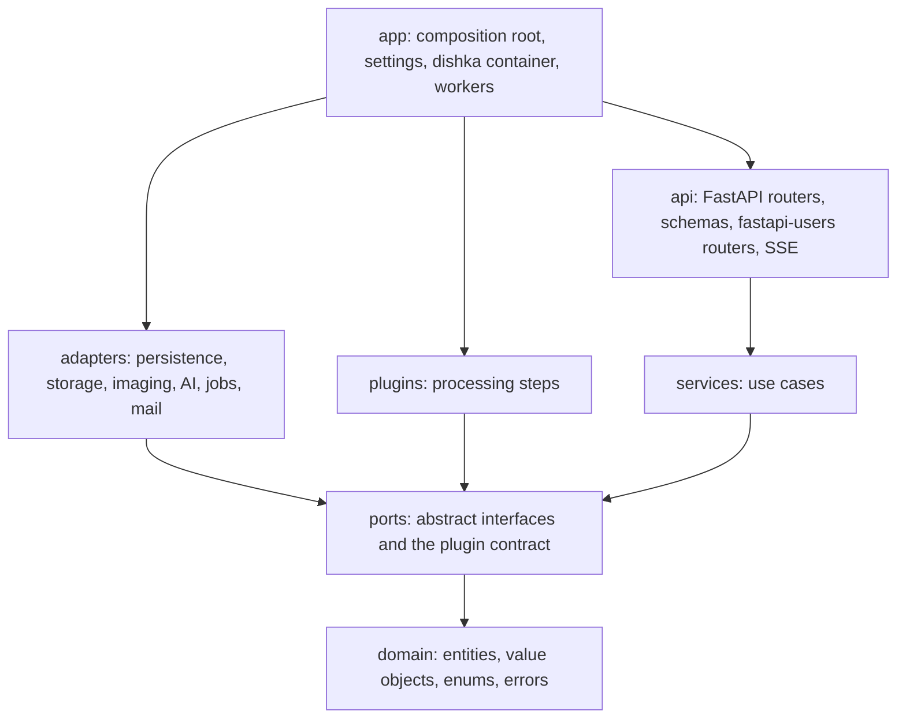
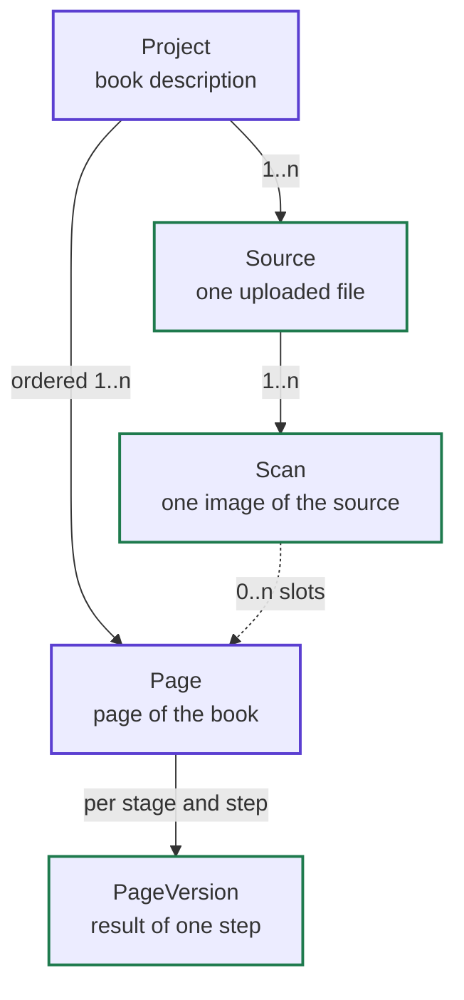
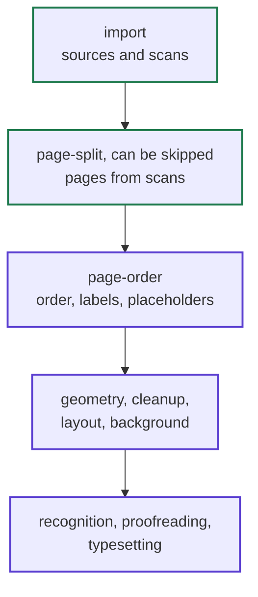
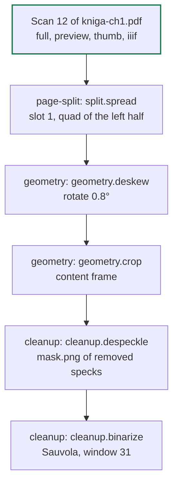
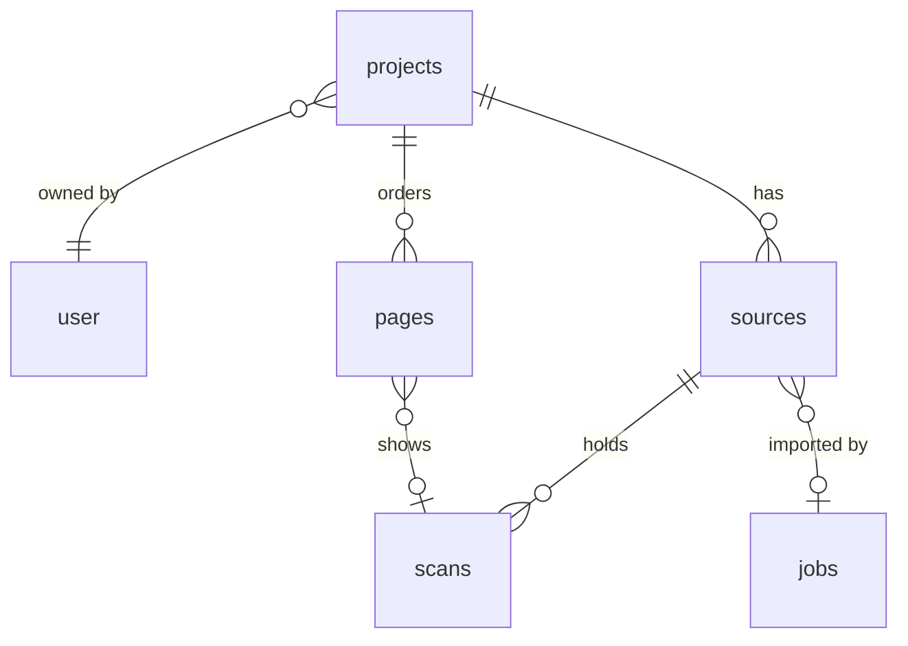
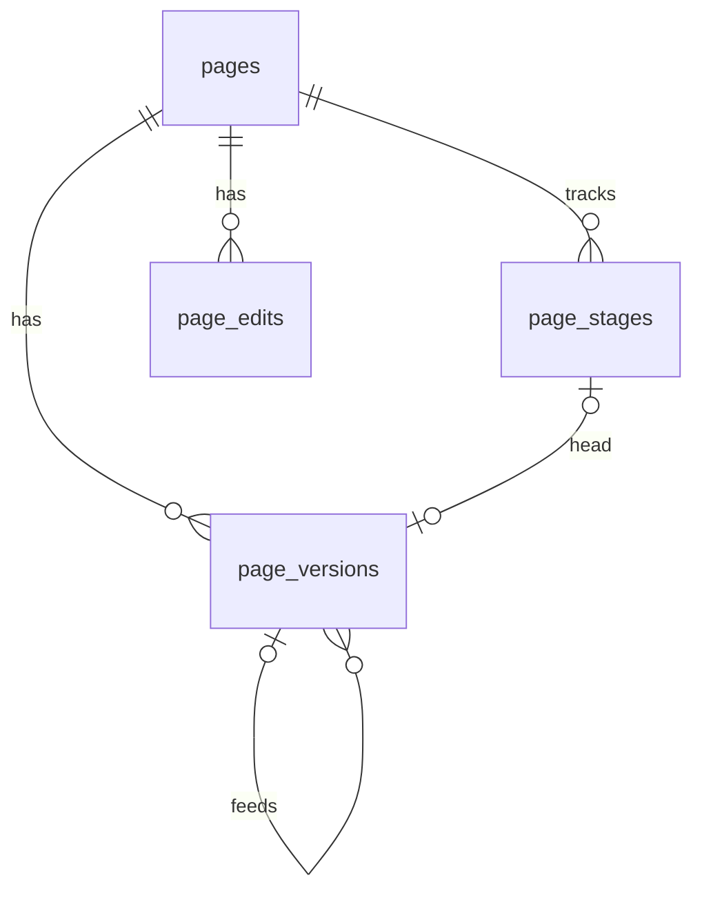
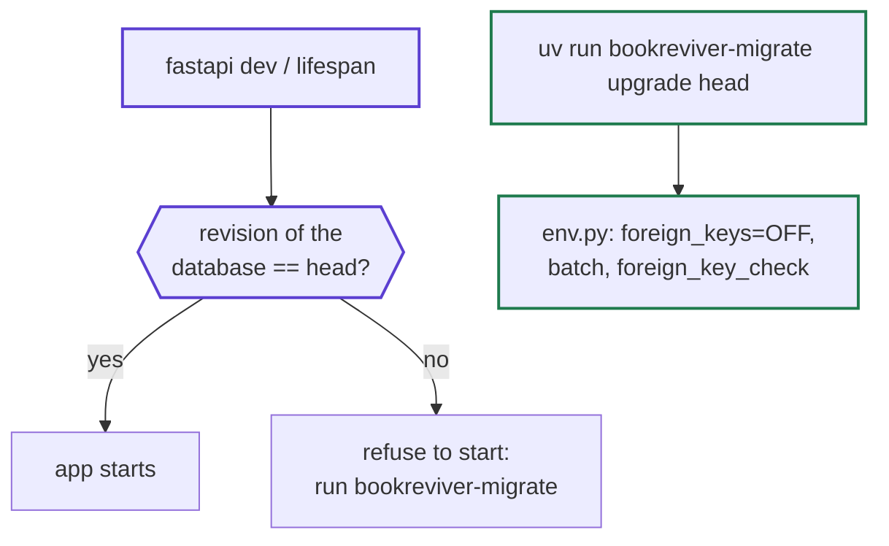
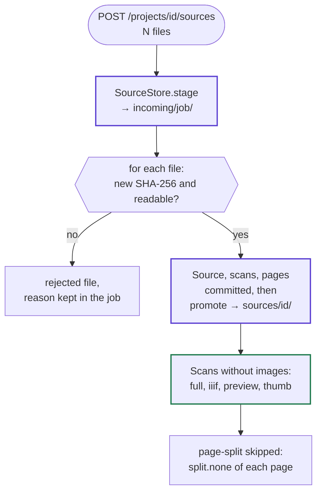

# BookReviver architecture

BookReviver turns scans of old printed books into corrected, re-typeset editions. One project is one book, owned by
an account, and it is kept apart from the files it was assembled from. A book moves through stages (import, page
split, page order, geometry, cleanup, layout, background, recognition, proofreading, typesetting), and every stage
stays viewable and re-runnable at any time. Processing steps are plugins, OCR engines and language models are
interchangeable, and heavy work runs on workers that can live on other machines.

This document is the source of truth for structure and contracts. `CLAUDE.md` holds the working rules derived from
it. A change that contradicts this document updates the document in the same pull request.

## Principles

1. **Reuse before writing.** Every concern starts from the library, framework feature or community pattern that
   already solves it, found by reading its documentation and its bundled guides (FastAPI ships one in
   `fastapi/.agents/skills/fastapi/`). Code of our own covers only what is specific to BookReviver, and a pull request
   that writes something a dependency already offers says why.
2. **Ports and adapters.** The core (domain and services) defines abstract ports for everything outside it:
   persistence, file storage, mail, image processing, AI engines, jobs, events, time. Adapters implement the ports.
   The core imports no framework, no driver and no library that touches I/O.
3. **Every adapter is replaceable.** Swapping the database, the file store, the job broker, an OCR engine or an LLM
   provider means another adapter of the same port selected in the composition root. No service, route or service
   test changes.
4. **Substitutability is proven.** Each port has a contract test suite that runs against every one of its adapters,
   including the in-memory adapter the service tests use.
5. **Asynchronous end to end.** Every port method is `async`. The API, the database (SQLAlchemy 2.0 `AsyncSession`),
   file access and outbound HTTP (`httpx.AsyncClient`) never block the event loop. Blocking library calls go through
   Asyncer (`asyncify`) inside adapters, and heavy work runs only in background jobs.
6. **Extension without rewriting.** Processing steps, OCR engines, layout analysers and language models are plugins
   discovered through Python entry points. Adding one is a new package or module, not a change to the application.
7. **Dependencies point inwards only.** `import-linter` enforces the layer order and forbids infrastructure libraries
   in the core, as part of the pre-commit gate.

## Libraries

What each concern reuses, and therefore what we do not write ourselves.

| Concern                    | Library or feature                                              | Not written by us                                |
| -------------------------- | --------------------------------------------------------------- | ------------------------------------------------ |
| HTTP API                   | FastAPI: `Annotated` dependencies, router-level prefix and tags | Routing, validation, OpenAPI                     |
| Server-sent events         | FastAPI `EventSourceResponse`, `ServerSentEvent`                | Event stream formatting                          |
| Serving the frontend       | FastAPI `app.frontend()`                                        | Static files and client-side routing fallback    |
| Running                    | `fastapi dev`, `fastapi run`, `[tool.fastapi]` entrypoint       | Server bootstrap                                 |
| Dependency injection       | dishka, with its FastAPI and Taskiq integrations                | Container, scopes, wiring of workers             |
| Accounts                   | fastapi-users: register, verify, reset, cookie sessions, OAuth  | Auth flows, password hashing (pwdlib argon2)     |
| Social sign-in             | httpx-oauth: ready-made Google and Facebook clients             | OAuth 2.0 protocol, state                        |
| Rate limiting              | slowapi                                                         | Throttling of sign-in and registration           |
| CSRF                       | starlette-csrf                                                  | Double-submit cookie check                       |
| Persistence                | SQLAlchemy 2.0 async with advanced-alchemy repositories         | Generic CRUD, pagination, filters, column types  |
| Request validation         | Pydantic 2 models and constrained types, email-validator        | Parsing and checking input                       |
| Collection responses       | fastapi-pagination `Page[T]` and its `Params`                   | Paging schema and query parameters               |
| Error responses            | fastapi-problem (RFC 9457 problem details)                      | Error format, error schemas in OpenAPI           |
| Migrations                 | Alembic through advanced-alchemy's `AlembicCommands` and CLI    | Schema versioning, autogenerate, commands        |
| Secrets at rest            | advanced-alchemy `EncryptedString` with the Fernet backend      | Encryption of provider keys                      |
| Settings                   | pydantic-settings                                               | Environment and `.env` parsing                   |
| Background jobs            | Taskiq, in-process broker locally, Redis on a server            | Queueing, retries, worker processes              |
| Mail                       | aiosmtplib                                                      | SMTP                                             |
| PDF and images             | PyMuPDF, Pillow                                                 | Parsing and rasterising                          |
| DjVu                       | DjVuLibre command-line tools: `djvused`, `djvudump`, `ddjvu`    | DjVu parsing, rendering and text extraction      |
| XMP metadata               | defusedxml                                                      | XML parsing safe against hostile documents       |
| Page order                 | fractional-indexing                                             | Order keys that sort between two neighbours      |
| Tiles                      | pyvips `dzsave` with the IIIF 3 layout                          | Tile pyramids and `info.json`                    |
| Image processing plugins   | OpenCV, scikit-image                                            | Geometry, filtering, morphology                  |
| Language and vision models | pydantic-ai                                                     | Provider clients, structured output validation   |
| Plugin discovery           | `importlib.metadata.entry_points`                               | Plugin loading                                   |

SQLAlchemy 2.0 is kept even though FastAPI's guide suggests SQLModel, because the persistence adapter is the only
place that sees the ORM and SQLAlchemy is the explicit project choice.

DjVu is read through the DjVuLibre command-line tools and not through the `python-djvulibre` bindings. The original
bindings are archived, their continuation is published as source only and is built against the DjVuLibre headers, so
`uv sync` would fail on a machine without them. The bindings are GPL-2.0-only and the project is AGPL-3.0, which leaves
linking them into one process an open licence question, while a tool runs as a process of its own. It also means a
tool that crashes on a damaged file does not take the worker down. PyMuPDF does not read DjVu. The tools are a system
package, `djvulibre` on openSUSE and `djvulibre-bin` on Debian, which the README lists.

## Layers



| Package    | Owns                                                                   | May import                     |
| ---------- | ---------------------------------------------------------------------- | ------------------------------ |
| `app`      | Settings, adapter selection, plugin discovery, container, worker entry | every package below            |
| `api`      | HTTP routes, schemas, auth routers, SSE, error mapping                 | `services`, `domain`           |
| `adapters` | Implementations of ports over concrete technologies                    | `ports`, `domain`              |
| `plugins`  | Built-in processing plugins, written exactly like external ones        | `ports`, `domain`              |
| `services` | Use cases, business rules, authorisation                               | `ports`, `domain`              |
| `ports`    | Abstract base classes, the plugin contract                             | `domain`                       |
| `domain`   | Entities, value objects, enums with labels, the error hierarchy        | the standard library and attrs |

- `api`, `adapters` and `plugins` never import each other. Adapter families never import each other.
- `services` and `domain` may not import SQLAlchemy, advanced-alchemy, FastAPI, fastapi-users, Pydantic, Taskiq,
  pydantic-ai, PyMuPDF, Pillow, pyvips or OpenCV. The import-linter contract lists these packages explicitly.
- Accounts are the one place where a framework owns a table: fastapi-users keeps its user, OAuth account and access
  token tables inside the persistence adapter, and the core sees only an `AccountId` and the acting `Actor`.
- Background job entry points live in `app`: dishka resolves a service for the job, which calls one method.

## Domain

Pure Python with `attrs`. Entities are frozen and changed through `attrs.evolve`. Identifiers are `NewType`s, and
every closed set of values is a `StrEnum` carrying its own label.

| Area         | Types                                                                                         |
| ------------ | --------------------------------------------------------------------------------------------- |
| Identifiers  | `AccountId`, `ProjectId`, `SourceId`, `ScanId`, `PageId`, `PageVersionId`, `JobId`            |
| Accounts     | `Actor`, `AccountSettings` (default engine and model per `AiTask`)                            |
| Credentials  | `ProviderCredential` with a masked secret, never printed or logged                            |
| Books        | `Project`, `ProjectOverview`, `BookDetails`, `ImagePolicy`                                    |
| Changes      | `BookDetailsChanges` keeping a field at `KEEP`, `ProjectChanges` and `CoverChange`            |
| Book parts   | `Contributor`, `ContributorRole`, `BookIdentifier`, `IdentifierScheme`, `Script`, `RightsStatus` |
| Sources      | `Source`, `SourceFile`, `SourceKind`, `FileType`, `MetadataSuggestion`                        |
| Scans        | `Scan`, `ScanFacts`, `Renditions`                                                             |
| Pages        | `Page`, `PageOverview`, `PageKind`, `PageOrigin`, `PageVersion`, `VersionInputs`,             |
|              | `VersionState`, `VersionScale`, `PageStage` and its `StageState`                              |
| Page order   | `PageAnchor` (a page and a `Side`), `PageChange`, and `PageOverview` with its position        |
| Page labels  | `LabelStyle`, `PageNumbering`, and `PageChanges` for the editable fields of a page            |
| New pages    | `NewPage`, `NewPageOrigin` (blank or placeholder), `PageSize`, `VersionData` (data keys)      |
| Storage keys | `StorageKey`, and `ProjectKeys` in `domain/keys.py`, the one builder of every key             |
| Processing   | `Stage`, `ProcessorRef`, `Recipe` (a variant is a recipe that is not active), `Step`          |
| Geometry     | `Point`, `Size`, `Rect`, `Quad`, `Line`, `Rotation` and `Transform` in `domain/geometry.py`   |
| Edits        | `PageEdit` with its `EditorKind` and a shape (`Rect`, `Quad`, `Line`, `Rotation`) or a mask   |
| Events       | `JobChanged`, `SourceImported`, `ScanReady`, `PagesChanged`, `PageVersionReady`, and others   |
| Jobs         | `Job`, `JobKind` (the import, the preparing of pages and the four processing jobs), `JobState` |
|              | `Progress`, `WorkerPool`                                                                      |
| Imports      | `ImportRequest`, `ImportResult`, `RejectedFile`, `RejectionReason`, `UploadProblem`           |
|              | `UploadPath` (a checked relative path), `SystemFile` (names an operating system adds)         |
| Queries      | `Slice[T]` (items and total), `SliceRequest` (offset and limit)                               |
| Errors       | `DomainError`, `NotFoundError`, `PermissionDeniedError`, `UploadRejectedError`, and others    |

### The book and its sources

A project describes one book, and the book does not depend on which files it was assembled from. A source can lack
some pages or the cover, the cover and missing pages can come from another copy, and one scan of a spread becomes two
pages of the book. The model therefore has five objects, each with its own identity and metadata:

- A **project** (`Project`) is the book: its bibliographic description (`BookDetails`) and the fields of the work on
  it.
- A **source** (`Source`) is one uploaded file, never changed after import, with its technical metadata.
- A **scan** (`Scan`) is one image inside a source: a page of a PDF or DjVu document, a frame of a multi-page TIFF, or
  the single image of a JPEG file.
- A **page** (`Page`) is a page of the book in book order, with its own copy of the image, its printed number and its
  kind. It does not depend on its source, and its link to a scan only records where it came from.
- A **page version** (`PageVersion`) is the result of one processing step on one page: the image in several sizes,
  the data of the step and the transform of coordinates from its input.

In the diagram a green outline marks objects that never change after they are written, and a purple outline marks
objects the user edits.



Scans and pages are separate objects because their numbers differ. A scan of a spread gives two pages, a cover from
another copy gives a page with no scan in the main source, and a page missed during scanning stays in the book as a
placeholder without a scan. Versions belong to the page and not to the scan, because the printed number, the order,
manual edits and recognised text have to survive a re-run of any stage.

The boundary between the sources and the book is the creation of pages. Before it everything depends on the kind of
source: PDF, DjVu and image files are read by different formats and give scans with different metadata. After it a
page stands on its own, with its own copy of the image and its own versions, and a PDF, a DjVu and a TIFF source look
the same to it. The stages run in this order, where the green ones depend on the kind of source and the purple ones
work only with pages of the book:



The page split creates pages from scans, so it still looks at the scan, and when it is skipped every scan becomes one
page. In the page order stage, `Stage.PAGE_ORDER` (`'page-order', 'Page order'`) right after `Stage.PAGE_SPLIT`, the
user arranges the pages and adds what the scans lack: missing pages, covers, title pages, blank leaves after the
cover and endpapers. Every later stage works only with pages of the book.

### Project and book description

A project holds two kinds of data. The book description belongs to the printed edition alone and is filled in by
hand or from the metadata of the sources, and the project fields belong to the work on the project. `BookDetails` in
`domain/values.py` is one frozen value with the groups below. Text fields are empty strings when unknown, lists are
tuples, `height_cm` is `None` when unknown, and `title` is the one field that may not be empty.

| Group                | Fields                                                                                   |
| -------------------- | ---------------------------------------------------------------------------------------- |
| Title                | `title`, `subtitle`, `parallel_titles`, `original_title`                                 |
| Contributors         | `contributors`: `Contributor` values of a name and a `ContributorRole`                   |
| Imprint              | `publisher`, `printer`, `publication_place`, `publication_year`, `edition`, `censorship` |
| Series and volume    | `series`, `series_number`, `volume`                                                      |
| Language and script  | `languages`, `orthography`, `script` (`Script`: unknown, Cyrillic, Latin, mixed)         |
| Physical description | `printed_pagination`, `height_cm`, `illustrations`, `binding`                            |
| Identifiers          | `identifiers`: `BookIdentifier` values of an `IdentifierScheme` and a value              |
| Subject and rights   | `subjects`, `rights` (`RightsStatus`: unknown, public domain, in copyright)              |
| Copy                 | `copy_holder` (whose copy was scanned), `copy_notes` (bookplates, marks)                 |
| Notes                | `notes`                                                                                  |

Field names follow the [DCMI Metadata Terms](https://www.dublincore.org/specifications/dublin-core/dcmi-terms/), so an
export to library formats later needs no translation of concepts. `printer` is the printing house, exported as a
contributor with the MARC role `prt`, `censorship` the censor's permit that pre-reform Russian books print, exported
as a `dcterms:description`, and `printed_pagination` the pagination as a catalogue states it, such as
"XII, 340 p., 8 l. of plates". `publication_year` stays a string, because a bracketed year, a range and an estimate are
not integers. `BookDetails.primary_author` is the first contributor with the role `aut`, else the first contributor of
any role, else an empty string, and it is what the project list shows.

- **Contributors.** One list, in the order of the title page, so two editors and their order are expressible. A
  `Contributor` keeps the name as printed, with the spelling and the initials of the book, and the name is checked for
  length alone. `ContributorRole` holds the [MARC Relator](https://www.loc.gov/marc/relators/relaterm.html) codes as
  values and the MARC terms as labels: `aut`, `edt`, `com`, `trl`, `ill`, `egr`, `ltg`, `pht`, `wpr` (writer of
  preface), `win` (writer of introduction), `ann`, `cmm`, `dte`, `ctb` and `oth`. The set is closed, and a new role is
  one member without a migration, since roles are strings inside a JSON column. The owner of the copy is not a
  contributor but `copy_holder`.
- **Identifiers.** `IdentifierScheme.normalize(raw)` in the domain, on the standard library, normalizes and checks a
  value: an ISBN loses hyphens and spaces and needs a correct ISBN-10 or ISBN-13 check digit, an OCLC number is digits,
  an LCCN follows the normalization of the Library of Congress (`n78-890351` is `n78890351`, `85-2` is `85000002`), a
  shelfmark is free text up to 300 characters, and a URL is an `http` or `https` address. A refusal is an
  `InvalidIdentifierError`, a `DomainError` and a `ValueError`, so Pydantic turns it into a validation error. Pre-reform
  books have no ISBN, and the scheme is for the reprints and facsimiles that are scanned in their place.
  `BookIdentifier.parse(scheme, raw)` normalizes, and the constructor refuses a value that is not normalized already.
- **Languages** are ISO 639-3 codes, as DCMI recommends, because a pre-reform book needs neither a region nor a script
  variant, and the script is a field of its own.
- **Changes.** `BookDetailsChanges` marks a field it leaves alone with the sentinel `KEEP` of the one-member enum
  `Keep` in `domain/changes.py`, because `None` is a value here: the empty height. Every other change of the domain
  still keeps a field left as `None`. `apply_to` replaces the fields that are not `KEEP` through `attrs.evolve`, so the
  validators of `BookDetails` check the result.
- **Storage.** Text fields and enums are columns of `projects`, and the four lists and the two lists of objects are
  JSON columns, because their items have no identity, they are always read and written with their project, and the
  project list shows only the title and the first author. The price is that projects cannot be searched by contributor
  in portable SQL. When such a search is needed, a JSONB index on PostgreSQL or a derived table written by the same
  mapper provides it. The mapper is the one place that knows the JSON shape.
- **Validation** happens in Pydantic before the route, and the identifier rule lives in the domain, so it checks both
  what a user types and what a file suggests. The lists are limited in length (50 contributors, 20 identifiers, 10
  languages without repeats, 50 subjects, 10 parallel titles), so a request cannot turn one row into megabytes of JSON.

The project fields are these:

- `id`, `owner_id` (the owning account), `created_at` and `updated_at`.
- `cover_page_id`, the page whose thumbnail the project list shows, or empty for the first page.
- `image_policy`, how the images of page versions are stored, `compact` or `lossless`, described with page versions
  below.
- `page_count` (pages of the book without the excluded ones), `source_count` and `scan_count`, computed when read
  and returned in `ProjectOverview`.

### Source

One file is one source. The model of a source is the same for every kind: a kind, its files, technical metadata and
an ordered list of scans. The one exception is an indirect DjVu document, whose index file and page files are not
documents on their own, so the whole set is stored as one source with several files. The metadata of a file stays in
its source and is never copied into the project, and the description values a source suggests fill only empty fields
of `BookDetails`.

| Upload                                                  | Sources             | Scans in a source          |
| ------------------------------------------------------- | ------------------- | -------------------------- |
| One PDF holding the whole book                          | 1                   | one per PDF page           |
| A book in three PDF parts                               | 3                   | one per page of each part  |
| One bundled DjVu document                               | 1                   | one per page               |
| An indirect DjVu document: an index and 300 page files  | 1, with 301 files   | 300                        |
| 300 single-page DjVu files                              | 300                 | 1                          |
| A directory of 400 TIFF, JPEG or PNG scans              | 400                 | 1                          |
| A multi-page TIFF                                       | 1                   | one per frame              |
| A separate `cover.jpg` from another copy                | 1                   | 1                          |

| Field           | Type                   | Meaning                                                                            |
| --------------- | ---------------------- | ---------------------------------------------------------------------------------- |
| `id`            | `SourceId`             | Identifier of the source, also the name of its storage directory                   |
| `project_id`    | `ProjectId`            | Project owning the source                                                          |
| `kind`          | `SourceKind`           | `pdf`, `djvu` or `image`                                                           |
| `file_type`     | `FileType`             | Exact format: `pdf`, `djvu`, `tiff`, `jpeg`, `jpeg-2000`, `png`                    |
| `file_name`     | `str`                  | Name the browser sent, with the relative path of a directory upload sanitised      |
| `files`         | `Sequence[SourceFile]` | Stored files with relative path, size and SHA-256; more than one only for indirect DjVu |
| `size_bytes`    | `int`                  | Total size of the files                                                            |
| `sha256`        | `str`                  | Hash of the main file, which refuses a second upload of the same file              |
| `scan_count`    | `int`                  | Number of scans                                                                    |
| `metadata`      | `MetadataMap`          | Technical metadata of the format                                                   |
| `suggestion`    | `MetadataSuggestion`   | Values of the book description found in the file                                   |
| `import_job_id` | `JobId \| None`        | Import job that created the source                                                 |
| `imported_at`   | `datetime`             | When the source became part of the project                                         |

Each format reads its technical metadata with its own library:

| Format                     | Library                                    |
| -------------------------- | ------------------------------------------ |
| PDF                        | PyMuPDF (`pymupdf.Document`)               |
| DjVu                       | DjVuLibre (`djvused`, `ddjvu`, `djvutxt`)  |
| TIFF, JPEG, JPEG 2000, PNG | Pillow (`PIL.Image`)                       |

A PDF source records the PDF version, the Info dictionary (Title, Author, Subject, Keywords, Creator, Producer and
the dates), whether it has XMP metadata, the page count, the outline, whether the file had to be repaired and whether
it is encrypted. The page labels are not kept in the metadata but read for every page with PyMuPDF's
`Page.get_label` and returned as `SourceAnalysis.scan_labels`, aligned with the scans, where a document that defines
no label rules gives empty strings. XMP is parsed with defusedxml. A DjVu source records whether the document is
bundled or indirect, the page count, the `print-meta` metadata, the `print-outline` outline and whether it has a text
layer, and it suggests a publication year only from `print-meta`. An image source records the format, the Pillow
mode, the frame count, the compression, the ICC profile, the EXIF data with `Orientation`, and the DPI.

`SuggestionBuilder` in `adapters/imaging/suggestions.py` turns the metadata of a file into its `MetadataSuggestion`,
and both `PdfFormat` and `DjvuFormat` use it. `from_docinfo` reads the PDF Info dictionary (Title, Author, Subject and
Keywords), `from_xmp` the Dublin Core elements of the XMP packet, and `from_djvu_meta` the pairs of `djvused -e
print-meta`. `merge` takes the first non-empty value of each field in order of priority: XMP before Info for a PDF,
because XMP lists several creators where Info holds one string, and BibTeX keys (`title`) before DocInfo keys (`Title`)
for DjVu. The Info author is split at semicolons only, since a comma occurs inside "Ивановъ, Н. Н.", keywords are split
at commas and semicolons, and `dc:creator` becomes authors (`aut`), `dc:contributor` contributors (`ctb`), and the
DjVu `author` and `editor` authors and editors (`aut`, `edt`). A `dc:identifier` becomes an identifier only when it is
a valid ISBN, with or without a `urn:isbn:` prefix, or an `http` or `https` address, and a `dc:language` tag becomes
a language only when its primary subtag is an ISO 639-3 code or an ISO 639-1 code from the small table of the module.
No date from a file becomes a year of publication except the DjVu key `year`: `creationDate`, `modDate` and `dc:date`
date the file, and for a scan the day it was made, so a year taken from them would look right and be wrong. The XMP
packet comes from an uploaded file and is parsed with `defusedxml` with DTDs forbidden, so a packet that declares
entities or external references, or is not XML, gives an empty suggestion.

### Scan

A scan is one image of a source as the file holds it. It is created by the import, never changes and holds the facts
of the image in `ScanFacts`. The source file of a scan is known from its source, so `ScanFacts` has no field naming
it.

| Field          | Type         | Meaning                                                                                  |
| -------------- | ------------ | ---------------------------------------------------------------------------------------- |
| `id`           | `ScanId`     | Identifier of the scan                                                                   |
| `project_id`   | `ProjectId`  | Project owning the source, so the scans of a book are listed without its sources         |
| `source_id`    | `SourceId`   | Source holding the scan                                                                  |
| `number`       | `int`        | Number of the scan in its source from zero: the PDF or DjVu page, the TIFF frame         |
| `source_label` | `str`        | Page label the file itself gives, such as the PDF page label `xii`, or empty             |
| `facts`        | `ScanFacts`  | Size in pixels, DPI, physical size, colour mode, bit depth, text layer, `extra`          |
| `renditions`   | `Renditions` | Readiness and version of the derived files, and the format of `full`                     |

A scan has four derived files, and a page version has the same four:

- `full` at native resolution, in the format the page's colour and the project's `image_policy` select. A bilevel
  image is always a 1-bit PNG with exactly two values, and a gray or colour image is a JPEG under `compact` and a PNG
  under `lossless`. A PDF page or an image file that already is a fitting JPEG is copied byte for byte when the format
  is a JPEG, and decoded into a PNG of the same pixels when it is a PNG. The format is chosen when the image is
  written, from `ImagePolicy.full_format(color_mode)`, and is recorded in `Renditions.full` next to the readiness and
  the version of the files, so the key of a stored image never depends on the policy as it is now. A scan stored before
  the format was recorded reads as a JPEG.
- `preview`, 2048 px on the longer side, for interactive previews of steps within the budget of under 1 s on the
  visible page.
- `thumb`, `imaging.thumbnail_long_side_px` on the longer side, 320 px by default.
- `iiif`, an IIIF Image API 3 level 0 tile pyramid cut by pyvips `dzsave`.

`preview` and `thumb` are always JPEG.

### Page

A page of the book is created from a scan by the page split, or added by the user in the page order stage, and from
then on it stands on its own. It has its own copy of the image, its own versions per step and its own metadata, and
nothing about it depends on the kind of source. Its link to a scan records where it came from and is needed only to
split the scan again. The identity of a page is stable: reordering, splitting again and re-running stages keep its
`PageId`, so its storage keys, manual edits and recognised text stay attached to it.

| Field                      | Type             | Meaning                                                                       |
| -------------------------- | ---------------- | ----------------------------------------------------------------------------- |
| `id`                       | `PageId`         | Identifier of the page                                                        |
| `project_id`               | `ProjectId`      | Project owning the page                                                       |
| `order_key`                | `str`            | Position in the book as a fractional index string                             |
| `label`                    | `str`            | Printed number, such as `xii`, `12` or `[4]`, or empty for an unnumbered page |
| `kind`                     | `PageKind`       | Role of the page in the book                                                  |
| `origin`                   | `PageOrigin`     | Where the image comes from: `scan`, `blank` or `placeholder`                  |
| `scan_id`                  | `ScanId \| None` | Scan of origin of a `scan` page, or empty                                     |
| `slot`                     | `int`            | Part of the scan the page shows                                               |
| `included`                 | `bool`           | Whether the page is part of the book                                          |
| `notes`                    | `str`            | Notes of the user                                                             |
| `created_at`, `updated_at` | `datetime`       | When the page was created and last changed                                    |

`PageKind` is `cover`, `back-cover`, `endpaper`, `frontispiece`, `title`, `text`, `plate`, `blank` or `other`. A
`scan` page holds a copy of a part of a scan, a `blank` page holds a generated blank leaf, and a `placeholder` holds
no image and waits for a scan. `scan_id` is empty for the last two, and for a `scan` page whose source was deleted.
`slot` is `0` for the whole scan, `1` and `2` for the left and right halves of a spread, and higher for fold-outs.
`included` is off for a page kept out of the book, such as a colour chart or a duplicate. The pair
`(scan_id, slot)` is unique, so one part of a scan never becomes two pages. The life cycle of a page follows these
rules:

- After an import the page split creates pages from the new scans. When the split is skipped, every scan gives one
  page with `slot = 0`, whose base version is a copy of the scan's `full` image. Pages of new scans are appended to
  the end of the book in upload order, and their printed number is the scan's `source_label`.
- Splitting a spread keeps the existing page as the left half (`slot = 1`) and inserts the right half (`slot = 2`)
  right after it. Each half gets its own copy of its part of the scan. Moving the split line recreates the base
  versions of both pages and marks their later stages stale. Undoing the split, which is running a step that does not
  split, such as `split.none`, on the left half, deletes the right page with its versions and edits. A run that would
  do so fails the page unless its request says `confirm_unsplit`, so the interface asks for confirmation first. A run
  over every page of the book leaves the right halves to the run of their left halves.
- In the page order stage a blank leaf (`origin = blank`), such as the back of the cover, an endpaper or the empty
  leaf after the title, gets a generated white image of the median page size of the book and then passes the stages
  like any page. A missing page, cover or title page without a scan (`origin = placeholder`) stays without an image
  until a scan from a new source is bound to it, and then it becomes a `scan` page whose base version is a copy of
  that scan.
- Deleting a source leaves the pages of the book alone, because they hold their own copies of the images. The pages
  of that source lose their `scan_id`, and splitting them again is no longer possible.

The split line of a spread is stored as the `line` edit of the left page, which joins the identifier of both base
versions, so moving it recreates only the base versions of the two pages and marks their later stages stale. The
`transform` of each base version is the `crop(quad)` of its half. From then on the two pages live independently of
each other and of the scan.

### Page versions

Stages are made of steps, and a step is one processor of the stage's recipe. A page version is recorded per step and
not per stage, because binarisation and despeckling are separate results, as the processing plugins below require.
The stages follow ScanTailor's order: split, deskew, content selection, cleanup, output.

A version is not a new page but a record of a page, a stage, a step and its parameters. A page object per stage would
have to carry the number, the order and the edits across every re-run, and the question "what is page 12 after
deskewing" would become a search along a chain. Versions never change: a re-run with other parameters creates a new
version, and the old one stays cached and returns at once when the user restores the old parameters.

| Field        | Type                    | Meaning                                                                          |
| ------------ | ----------------------- | -------------------------------------------------------------------------------- |
| `id`         | `PageVersionId`         | Hash of what produced the version, which is also the cache key of its result     |
| `page_id`    | `PageId`                | Page of the book                                                                 |
| `stage`      | `Stage`                 | Stage of the step                                                                |
| `processor`  | `ProcessorRef`          | Key and version of the processor, such as `geometry.deskew` 1.2                  |
| `input_id`   | `PageVersionId \| None` | Input version; empty for the base version, whose input is a scan or nothing      |
| `params`     | `MetadataMap`           | Parameters of the step, following the processor's JSON Schema                    |
| `transform`  | `Transform`             | Transform of coordinates from the input to the output                            |
| `data`       | `MetadataMap`           | Data of the step: angle, frames, removed areas, thresholds, confidence           |
| `renditions` | `Renditions \| None`    | The image in the same four sizes as a scan, or empty for a step without an image |
| `state`      | `VersionState`          | `pending`, `running`, `ready` or `failed`                                        |
| `created_at` | `datetime`              | When the version was created                                                     |

The identifier hashes the page, the processor key and version, the parameters, the input version and the manual
edit, cut to 16 hexadecimal digits. A `Transform` is `identity`, `crop(quad)`, `rotate(angle)`, `perspective(quad)`
or `mesh(key)`.

The first version of every page is its base version. For a page cut from a scan the `page-split` stage creates it,
with the step `split.spread` for a half of a spread or `split.none` when the split is skipped and the page is the
whole scan. For a blank leaf the `page-order` stage creates it with the step `pages.blank`. The base version holds its
own copy of the image, so the page does not depend on the files of the scan and survives the deletion of its source.

Metadata of the whole page lives in `Page`, and data of one step lives in `PageVersion.data` and
`PageVersion.transform`. The chain of transforms from the scan to any version maps coordinates back to the scan,
which is how recognised words are highlighted on the original and illustrations are cut for typesetting from the
colour scan instead of the binarised page.

| Stage         | Step                   | `transform`                | `data`                                                      |
| ------------- | ---------------------- | -------------------------- | ----------------------------------------------------------- |
| `page-split`  | `split.none`           | `identity`                 | copy of the whole scan, split skipped                       |
| `page-split`  | `split.spread`         | `crop(quad)` of a half     | position of the cut, overlap in pixels, size of the half    |
| `page-order`  | `pages.blank`          | `identity`                 | size of the generated blank leaf                            |
| `geometry`    | `geometry.deskew`      | `rotate(angle)`            | angle in degrees, confidence, whether it was skipped        |
| `geometry`    | `geometry.perspective` | `perspective(quad)`        | four corners of the page                                    |
| `geometry`    | `geometry.dewarp`      | `mesh(key)`                | key of the mesh, root mean square error                     |
| `geometry`    | `geometry.crop`        | `crop(quad)`               | content frame, margins                                      |
| `cleanup`     | `cleanup.despeckle`    | `identity`                 | number of removed specks, key of the mask `mask.png`        |
| `cleanup`     | `cleanup.binarize`     | `identity`                 | method (Otsu, Sauvola), threshold or window                 |
| `cleanup`     | `cleanup.eraser`       | `identity`                 | key of the mask from the manual edit                        |
| `layout`      | `layout.regions`       | `identity`, no image       | text and illustration regions as polygons                   |
| `recognition` | `recognition.ocr`      | `identity`, no image       | engine, model, confidence, key of the hOCR or ALTO text     |

The chain of versions of one page looks like this. The left half of a spread passes the split, deskewing, cropping
and cleanup, and each step refers to the one before. Recognition continues the same chain with a version without an
image.



The current version of a stage is kept in a separate `PageStage` record per page and stage: a reference to the
latest version of the stage's active recipe and a state, `fresh`, `stale` or `failed`. A change of an earlier version
marks the later stages of that page stale without deleting them, so the interface can show the old result until it
is recomputed. Recipes, variants and manual edits (`PageEdit`) are described under the processing plugins.

The format of `full` is set by the project setting `image_policy`, chosen when the project is created or in the stage
that creates pages:

- `compact`, the default: a bilevel page is a lossless PNG, and a gray or colour page a JPEG with the quality from the
  settings. A PNG of a colour scan at 600 DPI takes hundreds of megabytes per page, which is why this is the default.
- `lossless`: every version is a lossless PNG, so re-encoding between steps loses nothing. A colour book with five
  steps takes tens of gigabytes.

Changing the setting after pages exist applies only to new versions, and old ones are not re-encoded. The format of
every version is recorded with it in `Renditions.full`, which is why such a change cannot move the path of an image that
is already stored. The base version of a page copies the format of the scan it is cut from.

### Page order

The page order stage is `PageService`. A page is moved by writing a new `order_key` to it and to nothing else, so a move
of one page writes one row and a move of a group writes the rows of the group. Three moves exist, and each puts the
pages before or after an anchor page, a `PageAnchor`:

- **One page.** The service reads the key of the anchor and `neighbour_key` of the anchor on the chosen side, leaving the
  moved page out, and writes the key `OrderKeys.spread` gives for one page between the two keys, which is the key
  `between` gives.
- **A group.** The pages are read in book order, and the service finds the neighbour of the anchor without any page of
  the group and writes the keys `OrderKeys.spread` gives for the group's size between them, so the group stands
  together in the order it had.
- **A source.** The pages whose scans belong to the source are listed through `scans` and moved as a group, which puts
  a missing part of the book, such as a cover file or a quire from another copy, in its place with one request.

The anchor may not be one of the moved pages, since the place is then not defined, and that is a `ConflictError`. The
unique key of `(project_id, order_key)` refuses a second move to a place another one took first, and the repository
reports that as a `ConflictError` too, so the client answers it by reading the manifest again. A move writes the
`updated_at` of the pages it moves, commits, and then publishes one `PagesChanged`. Keys are not rebalanced: a key
grows by a character or two for a book arranged by hand, which a book of a few hundred pages never notices.

### Pages without a scan

A page the scans lack is added in a place of the book with `POST /projects/{id}/pages`, a `PageCreate` that names an
origin, `blank` or `placeholder`, the kind, an optional label and notes, and an optional place, which is the end of the
book when no anchor is given. The origin `scan` is refused, since only the split and the binding of a scan make such a
page. The key is made the way a move makes it, between the anchor and its neighbour or after the last page. Two kinds of page follow different rules:

- **A placeholder** is a missing page, a cover or a title page for which a scan is still to come. It has no image and no
  version, and the stages skip it.
- **A blank leaf** is a real leaf of the printed book that the scan lacks, such as the back of a cover. It gets the
  pending base version `pages.blank` of the stage `page-order`, recorded with the size of its image, and a job writes
  its white image. Its size is the median of the sizes of the base versions of the pages that are included and cut from
  a scan, the width, the height and the resolution each taken apart with `statistics.median`, so a single fold-out map or
  cropped scan does not move it. A request may give the size and the resolution instead, and then no median is taken.
  A book with no page that is included, cut from a scan and has a recorded size gives a blank leaf without a given
  size a `ConflictError` that says it is the recorded size that is missing, which also holds for a book whose scan
  pages are all kept out.

The image of a blank leaf is made by the `pages.blank` processor, which runs through `StepRunner` like every step. It
makes a black image with `Image.black`, adds 255 and saves it with `pngsave` at a bit depth of 1, so the leaf is the
1-bit PNG of a bilevel page whatever the project's image policy. libvips always writes a resolution into a PNG, so a
leaf made without one carries its own default, and the data of the base version, which says the resolution is unknown,
is what the book relies on.

`PUT /projects/{id}/pages/{page_id}/scan` binds a scan to a placeholder with a `ScanAttach`. It refuses a page that is
not a placeholder, a scan that is not cut yet and a scan that another page shows, which is a 409 naming those pages, and
a scan of another project is a 404. With `take_over` the pages that show the scan are deleted with their versions in the
same transaction and their files after it, so the page the import made of the scan gives way to the placeholder. The
page keeps the fields the placeholder had, takes `origin = scan` and `slot = 0`, takes the scan's `source_label` as its
label when it had none, and gets the pending base version `split.none`. `DELETE /projects/{id}/pages/{page_id}` removes
the page, its versions and, after the commit, everything under `assets/pages/<page_id>`, and leaves the scan and the
source.

None of these requests writes an image. Each commits the page and its pending version, and then queues a job of the kind
`prepare-pages` unless one is queued or running. The partial unique index `ix_jobs_one_active_prepare` keeps a project to
one such job, so two requests that both found none cannot both store one: the one that loses gets a
`ConflictError`, rolls back and relies on the job of the other, and two jobs never write the files of one version
together. A running job may have read its versions before a new one was committed, so a job that ends looks for pending
versions once more and queues a follow-up when it finds one, which is why a request may leave the queueing to the job
that runs. The task `prepare_pages` of `app/worker.py` calls `PageService.prepare_images`, which takes the pending and
the failed versions made by `split.none` and `pages.blank`, which are the ones it knows how to make, writes each one
and commits it before the next, and publishes `PageVersionReady`, so the viewer swaps an empty frame for the image
without reloading. A failed half of a split spread is left to the run that makes it. A version `split.none` is a copy
of its scan run through `StepRunner`, the same way the import does it, and a version `pages.blank` is a white leaf.
A version that cannot be made is stored as `failed` with its reason in `data['error']`, the job ends failed, and the
next job takes the failed versions again with the new ones, so there is no route to repeat a job. A page deleted while
the job runs takes its versions with it, so a version whose page is gone is nothing to make and nothing that failed:
the job removes the files it wrote for it and goes on. An error nobody expected ends the job failed with a general
reason, so a job never stays running and blocks the next one.

The pages are committed before the job is queued, so a queue that refuses the job does not fail the request that made
the page, since a retry would add a second blank leaf. The job is then stored as failed with the reason
`NOT_QUEUED`, announced, and logged, and the next page that is added queues a new one.

### Printed numbers

The printed number of a page is its `label`, a string, empty for an unnumbered page, and the ranges a numbering was made
from are not stored. Four things write it:

- **The import.** A new page takes the `source_label` of its scan, which for a PDF is the label the document's page
  label rules give the page.
- **A patch.** `PATCH /projects/{id}/pages/{page_id}` follows JSON Merge Patch and changes the four fields the stage
  edits, `label`, `kind`, `included` and `notes`. A field left out is kept and a `null` label or note is cleared to an
  empty string. The kind and the inclusion have no empty value, so `null` for either is a 422. The order, the origin and
  the scan are changed by other routes, so a body naming them is a 422 too. `PageService.update` receives the domain
  value `PageChanges`, in which `None` keeps a field.
- **A numbering.** `POST /projects/{id}/pages/labels` takes a `LabelRange` and writes numbers into the pages from the
  first to the last in the book. The domain value `PageNumbering` holds the range, the `LabelStyle`, the first number,
  whether the label is in square brackets and the kinds to skip. The pages kept out of the book and the pages of a
  skipped kind take no number and keep their label, because the plates of an old book usually stand outside its
  pagination, and a page outside the range keeps its label as well. The style `none` erases the labels of the range.
  Only the pages whose label changes are written, and one `PagesChanged` of kind `edited` follows. The range may not run
  backwards, and a Roman style stops at 3999, so a numbering that would pass it is a 409 and the first number of a
  Roman range above it is a 422.
- **`LabelStyle.write`.** The Roman numerals are a dozen lines in the domain, because the domain imports only the
  standard library and the `roman` package would be its one dependency for a function that small.

## Ports

Ports are abstract base classes, so every adapter names its parent explicitly and the type checkers verify it.

| Group       | Ports                                                                                            |
| ----------- | ------------------------------------------------------------------------------------------------ |
| Persistence | `Repository[EntityT, IdT]` and one child per aggregate, `UnitOfWork`                             |
| Ordering    | `OrderKeys`: the key after the last page and the key between two neighbours                      |
| Storage     | `SourceStore` (uploads and the files of each source), `AssetStore` (derived files by key)        |
| Mail        | `Mailer`                                                                                         |
| Imaging     | `SourceInspector` (group an upload into sources, inspect one), `PageRasterizer`, `Tiler`,        |
|             | `RenditionWriter` (the files of a page version)                                                  |
| AI engines  | `TextRecognizer`, `LayoutAnalyzer`, `LanguageModel`, each with an engine catalogue               |
| Processing  | `Processor` (the plugin contract), `ProcessorCatalog`                                            |
| Runtime     | `JobQueue`, `EventPublisher`, `EventStream`, `Clock`                                             |

Every repository method takes the acting account, so a query can never cross account boundaries.

The persistence ports address data through the source, the scan and the page of the book. `ProjectRepository`,
`SourceRepository`, `ScanRepository`, `PageRepository`, `PageVersionRepository` and `JobRepository` share the
`UnitOfWork`, so one use case changes all of them in one transaction. `PageRepository` addresses a page by its
`PageId`, lists the pages of a project in `order_key` order and gives the last key of a book, and the position of a
page in the book is computed when it is read, never stored: a window of the manifest numbers its pages from its
offset, and `count_before` counts the pages before one page read alone. The page order stage adds the queries a move
needs, all inside one project and in `order_key` order: `list_by_ids` reads the named pages and refuses an identifier
of another project like a missing one, `list_for_source` joins `pages` with `scans` so that placeholders and blank
leaves never belong to a source, `neighbour_key` finds the key next to a key on one side while leaving the moving pages
out, and `update_many` writes several pages in the one transaction, all or none. `ScanRepository.list_by_ids` gives
the manifest the source of every page of a window in one query. The manifest shows each page by its current version of
the latest stage that has an image, found by the `PageStage` records, and by its newest base version when no stage has
one yet. `PageStageRepository.list_for_pages`, `PageVersionRepository.list_by_ids` and `list_base_versions` read those
for a whole window in one call each, so the manifest costs no query per page, and the shape of its answer is the same.
`ProjectRepository.overview` counts the book of one
project, and the project listing counts every project of a window in the same query.
`OrderKeys` is a port with an adapter on fractional-indexing, because the domain imports only the standard library
and attrs. Like `Clock.now`, its methods are synchronous, because they compute a string and wait on nothing.

The storage ports divide the files of a project by prefix. `SourceStore` owns `incoming/` and `sources/`, and
`AssetStore` owns `assets/`, so each port can delete everything of a project it holds:

| Port and method                                 | Target                                                                        |
| ----------------------------------------------- | ----------------------------------------------------------------------------- |
| `SourceStore.stage`                             | `(project_id, job_id, files, max_bytes) -> Sequence[SourceFile]`              |
| `SourceStore.promote`                           | `(project_id, job_id, source_id, names)`                                      |
| `SourceStore.discard`                           | `(project_id, job_id)`                                                        |
| `SourceStore.staged_files`, `source_files`      | Local paths of the files of one job by relative path, or of one source        |
| `SourceStore.delete_source`                     | `(project_id, source_id)`                                                     |
| `SourceStore.delete_project`                    | Removes `sources/` and `incoming/` of a project                               |
| `AssetStore.writable`, `readable`               | Only keys under `projects/<id>/assets/`                                       |
| `AssetStore.copy`                               | `(source, target)`, both under `assets/`, the copy standing on its own        |
| `AssetStore.delete_prefix`                      | Only prefixes under `projects/<id>/assets/`                                   |
| `AssetStore.delete_project`                     | Removes `assets/` of the project                                              |

`stage` reports the relative path, the size and the SHA-256 digest of every staged file as a `SourceFile`, computed
while the upload streams in, so no service reads files itself to learn their size or to refuse a duplicate. It keeps
the folders of a directory upload under `incoming/<job_id>/`, refuses a path that `UploadPath.parse` finds unsafe or
two paths that differ only in letter case, and no longer refuses an upload to a project that has sources.
`staged_files` gives the paths by relative name in the order of the names, since two files of different folders can
share a base name. `promote` moves the files of one source from the job's directory to the source's own directory in
one rename, storing each under the last segment of its path, and a refused promotion leaves the files staged.

The imaging ports work on one source at a time. `SourceInspector.group(files)` takes the files of an upload by relative
name in the order of the upload and splits them into sources, in that order, and assembles an indirect DjVu document
from its index file and the page files of its own folder, because which files make one source is a property of the
format. Nothing sorts the files, since the order of the upload is the order of the book. `SourceInspector.inspect` describes one source and its scans, and
`PageRasterizer.extract` writes one scan of one source in the format of `full` its caller asks for, because only the
caller knows the project's `image_policy`. `Tiler` cuts the IIIF pyramid (`tile`), the preview
(`preview`) and the thumbnail (`thumbnail`) of an image, each at the size the imaging settings give.

The persistence ports answer the two questions an import retry asks. `ScanRepository.list_unready` returns the scans of
a project whose renditions are not ready, source by source in import order, and `PageRepository.list_for_scan` returns
the pages cut from one scan by their slot.

## Adapters

| Port family | Adapter now                                                     | Test adapter   | Later                  |
| ----------- | --------------------------------------------------------------- | -------------- | ---------------------- |
| Persistence | advanced-alchemy repositories on SQLAlchemy 2.0, aiosqlite      | in-memory      | PostgreSQL by URL only |
| Ordering    | fractional-indexing                                             | the same       |                        |
| Storage     | Local directory tree under `data/`                              | local, tmp dir | S3-compatible storage  |
| Mail        | Log mailer, aiosmtplib over SMTP                                | recording fake |                        |
| Imaging     | Source reader with PDF, image, DjVu formats, pyvips tiler and blank leaves | fake images | remote workers |
| AI engines  | pydantic-ai for cloud and Ollama models, local Surya, Tesseract | scripted fakes | more providers         |
| Jobs        | Taskiq with the in-process broker                               | inline runner  | Taskiq with Redis      |
| Events      | In-process broadcast                                            | in-memory      | Redis pub/sub          |

The storage ports hand out local paths for the imaging libraries to read and write, so the storage test adapter is
the local one over a temporary directory rather than an in-memory store.

One `SourceReader` implements both `SourceInspector` and `PageRasterizer`, and hands each call to the `SourceFormat`
registered for the `SourceKind` of the source: `PdfFormat` (PyMuPDF), `ImageFormat` (Pillow) and `DjvuFormat`. Each
format holds the grouping, the inspection and the scan extraction of its kind, in a module of its own under
`adapters/imaging/`. `group` finds the kind of every file from its `FileType` and lets the format of that kind decide
which of its files make one source; by default every file is a source of its own. A PDF source is one file whose
pages are its scans, and an image source is one file whose TIFF frames are its scans, a JPEG, JPEG 2000 or PNG file
holding one. The imaging provider registers the formats, and the reader refuses to start unless every kind has
exactly one. Supporting another kind of source is a new `SourceKind` member, a new format and one entry in the
provider.

Colour is managed where a page leaves its source, and nowhere after it, so every stage receives a gray or RGB `full`
image, tagged sRGB when its colour was converted. A CMYK, LAB or YCbCr page of an image file changes its colour space
when it becomes RGB, so the profile embedded in the file stops describing its pixels. `ImageFormat` therefore converts
such a page from its embedded profile to sRGB with Little CMS, through Pillow's `ImageCms.profileToProfile`, with the
relative colorimetric intent, which keeps the tones of paper and ink that sRGB can show and does not compress the gamut
as the perceptual intent would. A page without a profile, or with one that does not apply to its pixels, is converted
by Pillow's own formula, and the second case is logged. Either result is tagged with the sRGB profile, which the
converted page is in. Little CMS is used through Pillow and not through `pyvips`, so the image format keeps to one
library; the tests use libvips as the independent reference, and its built-in CMYK profile builds the CMYK samples, so
no profile file is committed. MuPDF converts the CMYK images of a PDF page itself when `PdfFormat` renders it, and its
colour management is switched on by default in the PyMuPDF in use, which a test pins, so the adapter never calls
`pymupdf.TOOLS.set_icc`.

`DjvuFormat` runs the DjVuLibre tools, which the provider finds with `shutil.which` when the container is built. It
tells the three kinds of DjVu file apart, a bundled document, an indirect index and a single page, from the first 27
bytes of the file before it runs any tool, so the kind is the `DjvuDocumentKind` in the metadata of the source. It
takes the page count and the metadata from `djvused`, and the size, resolution and chunks of every page from one
`djvudump` call per file. The chunks give the colour mode: only the `Sjbz` mask is bilevel, and an IW44 layer marked
`(color)` is colour. It renders a page with `ddjvu` at native resolution into a temporary PNM file, and Pillow writes
the JPEG or the PNG, a bilevel page being a 1-bit PNG as decision 22 asks. A
call is one `subprocess.run` with a list of arguments, a timeout of `imaging.djvulibre_timeout_s` and the exit
status checked. A tool that fails, hangs or is missing becomes an `UnsupportedSourceError` that names the file and
never shows the tool's output, which goes to the log. An indirect document whose index names a file that is not among
the files of the source is refused with the list of missing files.

`DjvuFormat.group` finds the index files among the DjVu files of an upload by their headers and joins each with every
component that `djvused -e ls` lists for it, page files, shared data, annotations and thumbnails, the index first and
then the components in the order of the index. Only the components of kind `P` become scans, in that order. A DjVu
file that no index names is a source of its own, and so is one that is not DjVu, so `inspect` refuses it by name
without stopping the other files. An index whose components are not all in the upload is still one source made of the
index and the components that are, and `inspect` refuses it as a whole with the list of missing files, which the
import reports as an unreadable file while it imports the rest of the upload. Grouping and inspection are separate
calls because `group` must not read the pages. Without the tools every file is a source of its own.

The persistence adapter keeps its table classes private and maps rows to domain entities in one mapper per entity.
Each port repository wraps an advanced-alchemy `SQLAlchemyAsyncRepository`, so generic queries come from the library
and each repository adds only its own. The database's checks surface as domain errors naming the keys involved: a
missing row or a missing parent row as `NotFoundError`, and a key already stored as `ConflictError`. The port states
both, so the in-memory adapter raises the same errors.
The library's audit columns are not used, because the domain sets `updated_at` through its `Clock`, and for the same
reason the engine and sessions come from an advanced-alchemy `SQLAlchemyAsyncConfig` with its touch listener off.
Tables are SQLAlchemy 2.0 declarative classes on advanced-alchemy's `DefaultBase`, which brings the shared metadata
and the portable `GUID`, `DateTimeUTC` and `JsonB` column types. Keys are declared on each table, and a project's
sources, pages and jobs are relationships with `lazy="raise"`, so an `AsyncSession` never loads them implicitly, and
with `passive_deletes=True`, so their deletion is left to the `ON DELETE CASCADE` foreign keys.
Adapters are selected by settings read once in `app` (`BOOKREVIVER_DATABASE_URL`, `BOOKREVIVER_STORAGE`,
`BOOKREVIVER_JOB_BROKER` and so on).

### Database tables

The first diagram shows the book and its sources and leaves out the link from `projects` to `jobs`, and the second
shows the processing tables of page versions. The `recipes` table belongs to the project and is left out of the
second diagram. The diagrams show only keys and links, and the list below them gives the constraints and columns.





- `projects` has the primary key `id`, and `owner_id` references `user.id` with `ON DELETE RESTRICT`. Its columns are
  the `BookDetails` fields, `cover_page_id`, `image_policy`, `created_at` and `updated_at`. The lists
  (`parallel_titles`, `languages`, `subjects` of strings, `contributors` of `{name, role}` and `identifiers` of
  `{scheme, value}` objects) are advanced-alchemy `JsonB` columns defaulting to `[]`, the text columns added by the
  extended description default to `''`, `script` and `rights` default to `'unknown'`, and `height_cm` is a nullable
  integer. `cover_page_id`
  references `pages.id` with `ON DELETE SET NULL`, so a deleted cover falls back to the first page, and the
  repository refuses a cover that is not a page of the project, which a key over both columns could not empty alone.
- `sources` has the primary key `id`, `project_id` with `ON DELETE CASCADE`, `import_job_id` with
  `ON DELETE SET NULL`, and a unique `(project_id, sha256)`. Its columns are `kind`, `file_type`, `file_name`, `files`
  as JSON, `size_bytes`, `sha256`, `scan_count`, `metadata` and `suggestion` as JSON, and `imported_at`.
- `scans` has the primary key `id`, `source_id` and `project_id` with `ON DELETE CASCADE`, and a unique
  `(source_id, number)`. Its columns are `number`, `source_label`, one column per field of `ScanFacts`,
  `renditions_ready`, `renditions_version` and `renditions_full`, the format of the `full` image, whose server default
  `full.jpg` is what every scan stored before the format was recorded reads as.
- `pages` has the primary key `id`, `project_id` with `ON DELETE CASCADE`, `scan_id` with `ON DELETE SET NULL`, and
  the unique pairs `(project_id, order_key)` and `(scan_id, slot)`. Its columns are `order_key`, `label`, `kind`,
  `origin`, `slot`, `included`, `notes`, `created_at` and `updated_at`.
- `jobs` has the primary key `id` and `project_id` with `ON DELETE CASCADE`. Its columns are `kind`, `state`,
  `progress_done`, `progress_total`, `error`, `request`, `params` and `result`, the last two as JSON, `request` and `result` empty for a job that has none and `params` an empty object,
  `created_at`, `started_at` and `finished_at`. The partial unique index `ix_jobs_one_active_import` on `project_id`
  `WHERE kind = 'import-source' AND state IN ('queued', 'running')` keeps a project to one import at a time, and
  both adapters report its violation as a `ConflictError` when the job is added. The partial unique index
  `ix_jobs_one_active_prepare` on `project_id` `WHERE kind = 'prepare-pages' AND state IN ('queued', 'running')` does
  the same for the jobs that write page images, and an import and a prepare job of one project do not collide. The
  partial unique index `ix_jobs_one_active_processing` on `project_id` `WHERE kind IN ('collect-versions', 'cut-tiles',
  'preview-step', 'run-stage') AND state IN ('queued', 'running')` keeps a project to one job that processes the
  versions of its pages, so two runs never write the same files and a collection never deletes what a run reuses.
- `page_versions` has the primary key `id`, `page_id` with `ON DELETE CASCADE`, `input_id` with `ON DELETE SET NULL`,
  and an index on `(page_id, stage)`. Its columns are `stage`, `processor_key`, `processor_version`, `params`,
  `transform` and `data` as JSON, `renditions_ready`, `renditions_full`, `state`, `scale` (`full` or `preview`),
  `edit_hash`, `tiles_ready` and `created_at`. Both renditions columns are null for a step without an image, and
  `tiles_ready` says whether the IIIF pyramid is cut, which a run does only for a current version.
- `page_stages` has the primary key `(page_id, stage)`, `page_id` with `ON DELETE CASCADE`, and `head_version_id` and
  `recipe_id` with `ON DELETE SET NULL`. Its columns are `state` and `updated_at`.
- `page_edits` has the primary key `(page_id, stage, processor_key)` and `page_id` with `ON DELETE CASCADE`. Its
  columns are `kind`, `geometry` as JSON, `mask_key`, `edit_hash` and `updated_at`.
- `recipes` has the primary key `id`, `project_id` with `ON DELETE CASCADE`, an index on `(project_id, stage)`, and the
  partial unique index `ix_recipes_one_active` on `(project_id, stage)` `WHERE active`, which keeps one active recipe
  per stage. Its columns are `stage`, `name`, `steps` as JSON, `active`, `created_at` and `updated_at`.

`order_key` holds a fractional index string from the fractional-indexing package, such as `a0`, `a0V` or `a1`, so
inserting a page between two neighbours writes one row instead of renumbering the book. Keys compare byte by byte,
which is SQLite's `BINARY` collation and needs `COLLATE "C"` on the column in PostgreSQL. The API returns the
computed position of a page and never the key.

The owner's foreign key uses `RESTRICT` because a cascade would delete the rows of the projects but not their files,
so an account is deleted only after `ProjectService` has deleted its projects with their files. Only the SQLAlchemy
adapter checks this key: its contract fixtures create `user` rows, and `test_tables.py` pins the `RESTRICT`, while
the in-memory adapter has no accounts and there is no accounts port.

The tables `sources`, `scans`, `pages` and `page_versions` come with the book model, because a page gets its base
version with its own copy of the image when it is created, and the baseline migration creates them. `page_stages`,
`page_edits` and `recipes`, the columns `scale`, `edit_hash` and `tiles_ready` of `page_versions` and the column `params`
of `jobs` come with the processing framework, in one revision. The `request` and
`result` columns and the partial unique index of `jobs` came with the import job, in their own revision, and the
`renditions_full` columns of `scans` and `page_versions` came with the choice of the format of `full`, in another.
The columns of the extended description came in a revision of their own, which turns a non-empty `authors` string into one
contributor with the role `aut`, a `language` of three lower-case letters into the only item of `languages`, and any
other `language` into a `Language: ...` line appended to `notes`, and then drops `authors` and `language`. Its
downgrade rebuilds both from the first author and the first language.

### Migrations

The schema is versioned by Alembic revisions in `adapters/persistence/sqlalchemy/migrations/`, inside the package,
because the tables are private to the adapter and the revisions ship with the code that reads them. The directory
was created by advanced-alchemy's `init` with its asynchronous template. The first revision, the baseline, creates
every table listed above together with the fastapi-users tables.



- **Applying.** `uv run bookreviver-migrate upgrade head`, by hand only, after copying `data/` when it holds anything
  worth keeping. `bookreviver-migrate` is a script of the project: advanced-alchemy's `alchemy` command group with
  the database of the application's settings, because `alchemy` itself needs `--config` naming a configuration
  object that exists at import. Every `alchemy` command works through it, such as `downgrade`, `check`, `stamp`
  and `show-current-revision`. A database created before the baseline is recreated, or marked current with
  `stamp head` when its tables already match.
- **Start-up.** The lifespan opens the database, and `DatabaseProvider` compares the revisions of its version table
  `alembic_versions` with the head of the directory through `SqlDatabase.schema_revisions`. On a mismatch the
  application does not start. A database behind the code gets the upgrade command. A database at a revision the code
  does not ship, migrated on another branch, gets `bookreviver-migrate downgrade <head>` to run with the code that
  ships its revision, or the copy of `data/` to restore, because `upgrade head` cannot locate that revision. The
  check reads one table and runs no migration environment.
- **Creating a revision.** Change the tables, then run
  `uv run bookreviver-migrate make-migrations --autogenerate -m "Add the recipes table."` against a database at
  head, read the revision for every key and index, and run the gate, which formats it. `env.py` sets the options of
  autogenerate itself, because advanced-alchemy 1.11.0 does not hand those of `AlembicAsyncConfig` to Alembic. It
  compares column types, and on SQLite it compares a type whose name SQLAlchemy cannot reflect there, such as the
  `BINARY(16)` of advanced-alchemy's `GUID`, which reflects as `NUMERIC(16)`, by SQLite's affinity. It renders every
  type from outside SQLAlchemy by its own module, so fastapi-users' `GUID` and advanced-alchemy's `GUID`,
  `DateTimeUTC` and `JsonB` import what they are. A key declared with `use_alter`, such as the cover of a project,
  is added in a step of its own after the table it refers to, because PostgreSQL leaves it out of `CREATE TABLE`.
- **One transaction.** A command runs its revisions and the row of the version table in one transaction, so a
  migration applies whole or not at all. Revisions therefore run without advanced-alchemy's `autocommit_block`,
  which commits each statement. A revision that needs a statement outside a transaction, such as
  `CREATE INDEX CONCURRENTLY` on PostgreSQL, opens that block itself.
- **SQLite.** Batch mode, on by default, changes a table by copying it, dropping the old one and renaming the copy.
  The engine turns foreign keys on for every connection, and dropping `projects` with keys on would cascade to every
  source, scan, page and job, so `env.py` turns them off before the transaction begins, since SQLite ignores the
  pragma inside one. Python's `sqlite3` begins a transaction only before a row change, so `env.py` issues `BEGIN`
  itself and every `CREATE`, `DROP` and `ALTER` joins it. `PRAGMA foreign_key_check` runs inside the transaction,
  and a key that points nowhere rolls the whole migration back and fails the command. PostgreSQL has transactional
  DDL and needs neither pragma.
- **Tests.** `test_migrations.py` upgrades an empty database, runs `alembic check`, downgrades to base and upgrades
  again. With revisions rendered from the shipped template in a copy of the directory, it rebuilds `projects` in
  batch mode with a book stored, rolls back a revision that orphans the book, and fails `check` on a changed column
  type. It also checks that the application refuses an unmigrated database and one migrated by other code. Every
  other test creates the tables from the models and stamps the head revision, which is much faster and proven equal
  by `alembic check`.

## Services

| Service             | Use cases                                                                           |
| ------------------- | ----------------------------------------------------------------------------------- |
| `AccountService`    | Account settings, provider credentials, default engines and models                  |
| `ProjectService`    | List, create, read, edit the description, cover and image policy, delete with files |
| `ImportService`     | Accept an upload and enqueue the import, run the import job step by step            |
| `SourceService`     | List and read the sources and scans of a book, delete a source with its files       |
| `PageService`       | Page manifest, one page, order, labels, placeholders, blank leaves, binding scans   |
| `ProcessingService` | Recipes, previews, runs, variants, invalidation of later stages                     |
| `EditService`       | Save and load manual page edits (frames, meshes, masks, regions)                    |
| `JobService`        | Job state, cancellation, the event stream of a project                              |

Each service is a class constructed with the ports it needs and nothing else, and each checks that the acting
account may touch what it asks for. A use case that needs two services is composed by the caller. Registration,
sign-in, verification and password reset are fastapi-users routers, whose user manager hooks send mail through the
`Mailer` port.

## Accounts and security

Accounts use FastAPI Users instead of hand-written sign-in code, because registration, verification, password reset,
hashing, sessions and the OAuth flow are what it already maintains. The rules that are ours sit in the user manager
(`app/providers/accounts.py`) and in `app/security.py`.

- **Sign-in.** Email and password with a verified address, or Google and Facebook. A provider is enabled by
  configuring its client identifier and secret. A provider that returns no email address gets the error
  `400 OAUTH_NOT_AVAILABLE_EMAIL`.
- **Sign-in with X, future work.** X needs a fresh PKCE verifier on every authorization request, which the shared
  OAuth router cannot supply, so it returns as a router of its own. The scenario in which a user adds and confirms an
  address after a provider returned none comes back together with X.
- **Session.** An opaque token in the `bookreviver_session` cookie, which is `HttpOnly` and `SameSite=Lax`, and
  `Secure` unless `cookie_secure` is off for local development over HTTP. The database strategy stores the token in
  the `accesstoken` table, so deleting the row revokes the session at once, which a signed token cannot do before it
  expires. No tokens in browser storage.
- **CSRF.** starlette-csrf with the Double Submit Cookie pattern. The check applies to every mutating request that
  carries the `bookreviver_session` cookie, because only such a request can act as a user, and always to the six
  sign-in paths (login, register, request verification, verify, forgot password, reset password), so a forged form
  cannot sign a visitor into an account of the attacker. A mutating request without a session is not checked. OAuth
  callbacks are exempt because a provider redirects to them with a GET, and FastAPI Users compares their state with
  a cookie of its own. The frontend reads the `csrftoken` cookie and sends its value in the `x-csrftoken` header.
  A failed check is answered with a 403 RFC 9457 problem. `ProblemCSRFMiddleware` subclasses the starlette-csrf
  middleware and overrides its private `_get_error_response`, so its signature has to be checked whenever
  starlette-csrf is upgraded.
- **Rate limit.** The sign-in routes accept `10/minute;100/hour` per client address and path, and the counters are
  kept in process memory. A server behind a reverse proxy, or one that runs several processes, needs a Redis store
  and the real client address, otherwise every client shares the proxy's address and each process counts alone. The
  limit is a router dependency, `include_router(..., dependencies=[throttle])`, and not a `@limiter.limit`
  decorator, because FastAPI Users builds the routes. The empty function `count_sign_in_attempt(request)` carries
  the decorator, since SlowApi finds the request by the parameter named `request`.
- **Registered addresses stay private.** Registering an address that already has an account returns a response
  indistinguishable from a new registration and mails the owner instead. `PATCH /users/me` refuses an email change
  with 422, so an "address taken" answer cannot reveal which addresses are registered.
- **Linking a provider to an account.** A provider sign-in whose address matches an unconfirmed account joins that
  account. The address becomes confirmed and the password is replaced by an unknown one, so whoever registered the
  address before anyone proved owning it can no longer sign in with that password.
- **Password rules.** At least 12 characters, and the password must not contain the email address.
- **Deleting an account.** The user manager's `on_before_delete` hook first deletes every project of the user with
  its files through `ProjectService`, and only then is the user deleted, because the `RESTRICT` key of
  `projects.owner_id` refuses to leave projects without an owner.
- **Mail links.** Account messages link to `/verify-email`, `/reset-password` and `/sign-in` under
  `settings.public_url`. The frontend builds `/sign-in` and `/verify-email`, which reads the `token` of the link and
  posts it to `POST /auth/verify`. `/reset-password` comes with the account settings.
- Provider API keys are stored with `EncryptedString`, returned only masked, and decrypted only by the adapter that
  calls the provider.

## Processing plugins

A processing step is a plugin implementing the `Processor` contract. Built-in plugins live in `plugins/` and are
registered through the entry point group `bookreviver.processors` that an external package also uses, so the two are
indistinguishable to the application.

| Part of a processor | Meaning                                                                           |
| ------------------- | --------------------------------------------------------------------------------- |
| `spec`              | Key (`cleanup.despeckle`), version, title, `Stage`, scope (page or whole book)    |
| inputs and outputs  | `ArtifactKind`s it reads and writes: page image, mask, regions, text              |
| parameters          | A JSON Schema, from which the interface builds the settings form                  |
| editor              | Its `EditorKind`: none, line, rect, quad, rotation, mesh, brush mask, regions     |
| worker pool         | cpu, gpu or llm, which routes its jobs to the right workers                       |
| `run`, `preview`    | Full run, and a fast run on a downscaled page for interactive tuning              |

- A **recipe** is the ordered list of steps with parameters for one stage, saved per project, with presets per
  account. A **variant** is an alternative recipe for the same stage, and one variant per stage feeds the next.
- Every result of a page step is a **page version** with its provenance: processor key and version, parameters,
  input version and manual edit. Their hash is the version's identifier and the cache key, so re-running a recipe
  recomputes only changed steps, and changing a stage marks the later stages of the page stale. A result of a
  whole-book step, such as typesetting, is an **artifact** with the same provenance.
- Manual edits are inputs: a frame or mesh drawn by the user becomes the geometry a crop or dewarp processor reads,
  an eraser stroke becomes a mask, and the split line of a spread, drawn with the `line` editor, becomes the geometry
  of `split.spread`.
- A preview of a step runs as a background job, like every heavy computation, and its result reaches the browser
  over SSE.
- The base steps `split.none` and `pages.blank` are ordinary processors, and the import and the page order stage run
  them through the same `StepRunner` as a recipe.
- `split.spread` and `geometry.deskew` need OpenCV, so they live in the optional group `bookreviver[cv]`. A machine
  that lacks it starts without them, the catalogue leaves them out, and a default recipe that names them is not made.
  `split.spread` takes the darkest column of the central band of the scan as the gutter, or the `line` the user drew,
  and `geometry.deskew` takes the angle at which the ink of the page lies in the fewest rows, or the `rotation` the
  user gave, and leaves a page whose lines it is not sure of as it is.
- First plugins, in delivery order: page split, deskew, perspective crop by quad, dewarp by mesh, despeckle,
  binarisation (a cleanup step of its own, so the despeckled and the binarised page are separate artifacts), eraser
  mask, layout regions (text versus illustration), background separation, background unification (white, aged paper
  texture, custom colour, consistent across the book), recognition, proofreading.
- Heavy plugins declare optional dependency groups (`bookreviver[cv]`, `[gpu]`, `[llm]`) installed only on the
  workers of their pool, and a worker loads only the plugins of its pool.

## AI engines and models

- `TextRecognizer`, `LayoutAnalyzer` and `LanguageModel` are ports. Each engine adapter describes itself in a
  catalogue: name, languages and scripts, models, whether it needs a key or a GPU.
- Cloud language and vision models go through pydantic-ai (OpenAI, Anthropic, Google, Mistral, Ollama), with typed,
  validated structured output for proofreading and layout answers.
- Local engines (Surya, Tesseract, olmOCR served by vLLM) run on gpu or cpu workers behind the same ports.
- The account settings page sets provider keys and the default engine and model per task (recognition, layout,
  proofreading). Every run can override the engine, the model and the prompt preset from the processing panel.

## Files and assets

Storage keys, not paths, cross the ports. The local adapter maps them to `data/`, and an S3 adapter maps them to a
bucket when workers run on other machines.

Every file of a project lives under `projects/<project_id>/`, divided between the two storage ports. `SourceStore`
owns `incoming/` and `sources/`, and `AssetStore` owns `assets/`. An asset key always starts with
`projects/<id>/assets/`, so one prefix check keeps asset keys away from the files of the sources, and one
`delete_prefix` removes every derived file of a project. One class, `ProjectKeys` in `domain/keys.py`, builds every
key and refuses a `..` segment, so the layout is written down in one place and keys are stable when pages move.
`ProjectKeys.owning` attributes a key to a project only when it lies under `assets/`, so a key a client sends under
`sources/` or `incoming/` is no derived file and is answered like a missing one before any store is read.

- `incoming/<job_id>/` holds the upload of one import job while it is being received and checked.
- `sources/<source_id>/` holds the files of one source exactly as uploaded, written once.
- `assets/scans/<source_id>/<number>/v<n>/` holds the four renditions of one scan in version `n`.
- `assets/pages/<page_id>/<stage>/<processor>/<version_id>/` holds one page version: its renditions, a mask or
  a text such as `text.hocr`, and nothing for a step without output files.
- `assets/pages/<page_id>/edits/<processor>/` holds the manual edits of a page that steps read as inputs.
- `assets/book/` holds the results of whole-book steps, such as typesetting and export.

The layout of a book made of two PDF parts, a cover from another copy and an indirect DjVu document that supplies
missing pages looks like this:

```text
data/storage/
└── projects/
    └── 3f2a…c9/                               ProjectId
        ├── incoming/                          SourceStore: uploads still being received
        │   └── 7b1e…04/                       JobId of the import job owning the upload
        │       └── cover.jpg
        ├── sources/                           SourceStore: files as uploaded, written once
        │   ├── 0c55…a1/                       SourceId: PDF, part 1
        │   │   └── kniga-ch1.pdf
        │   ├── 9d02…17/                       SourceId: PDF, part 2
        │   │   └── kniga-ch2.pdf
        │   ├── 51aa…e3/                       SourceId: cover from another copy
        │   │   └── cover.jpg
        │   └── e4b7…60/                       SourceId: indirect DjVu, index and pages
        │       ├── index.djvu
        │       ├── p0045.djvu
        │       └── p0046.djvu
        └── assets/                            AssetStore: derived files, written once
            ├── scans/                         import stage: images of the scans
            │   └── 0c55…a1/                   SourceId
            │       ├── 0/                     number of the scan in its source
            │       │   └── v1/                version of the scan's renditions
            │       │       ├── full.jpg       native resolution, full.png for a bilevel scan or lossless
            │       │       ├── preview.jpg    2048 px on the longer side
            │       │       ├── thumb.jpg      320 px on the longer side
            │       │       └── iiif/          IIIF Image API 3 level 0 pyramid
            │       │           ├── info.json
            │       │           └── 0,0,512,512/…
            │       └── 12/
            │           └── v1/…
            ├── pages/                         pages of the book, from the split on
            │   ├── 1d4b…90/                   PageId: whole scan 11, split skipped
            │   │   └── page-split/
            │   │       └── split.none/
            │   │           └── 8c21f0d7e4a6b913/  base version: own copy of the scan
            │   │               ├── full.jpg
            │   │               ├── preview.jpg
            │   │               ├── thumb.jpg
            │   │               └── iiif/…
            │   ├── 77e0…2b/                   PageId: blank leaf after the cover
            │   │   └── page-order/
            │   │       └── pages.blank/
            │   │           └── 3a9c55e1b0f24d68/…  generated white leaf
            │   └── a81c…5d/                   PageId: left half of scan 12
            │       ├── page-split/
            │       │   └── split.spread/
            │       │       └── 4e9f0c2ab1d3e570/  base version: copy of the left half
            │       │           ├── full.jpg
            │       │           ├── preview.jpg
            │       │           ├── thumb.jpg
            │       │           └── iiif/…
            │       ├── geometry/
            │       │   ├── geometry.deskew/
            │       │   │   ├── 71c2d09e5b44a0f3/  angle 0.8°
            │       │   │   └── 0b93a1f7c2e85d19/  angle 1.1° after a manual edit
            │       │   └── geometry.crop/
            │       │       └── c3d1e8a04f77b2c6/…
            │       ├── cleanup/
            │       │   ├── cleanup.despeckle/
            │       │   │   └── 9a4e61b2d0c3f845/
            │       │   │       ├── full.jpg
            │       │   │       ├── mask.png   removed specks
            │       │   │       └── …
            │       │   └── cleanup.binarize/
            │       │       └── 2f60b7e9a15d8c07/
            │       │           ├── full.png   bilevel, PNG under any image_policy
            │       │           └── …
            │       ├── recognition/
            │       │   └── recognition.ocr/
            │       │       └── 5d17c4a9e002f6b1/
            │       │           └── text.hocr  no image
            │       └── edits/                 manual edits as inputs of steps
            │           └── cleanup.eraser/
            │               └── e1f0…/mask.png
            └── book/                          results of the whole book: typesetting, export
                └── typesetting/…
```

Deleting a source removes its files, the renditions of its scans under `assets/scans/<source_id>`, and then the source
with its scans, and leaves the pages of the book with their copies of the images, their versions, labels and order. A
source is not deleted while the project imports, and that answers 409. Deleting a project calls `delete_project` on
both storage ports and then removes its rows. Both deletions treat missing files as deleted, so one that fails part-way
keeps the project or the source, and repeating it finishes the job. Removing the rows first would leave the files of a
failed deletion where no request can reach them, because every request finds a project or a source by its row. This is
also how a user gets out of an import that keeps failing on one scan: the job result names the scan, and the user
deletes the source by hand, since nothing skips a scan automatically.

Nothing stored is ever replaced: a new version gets a new directory. Derived assets are regenerable under a new key,
the next version or content hash, which their URLs carry, so browsers cache them forever. Each is written under a
hidden sibling name and moved onto its key once complete, in a step the file system refuses when the key is taken,
so a second writer gets a conflict instead of replacing the first.

A tile pyramid's `info.json` carries as `id` the path of the IIIF route that serves it, passed to the `Tiler` port,
because the viewer builds tile URLs from it, and the root of that path comes from `app`, where the routes are
mounted. The path has no scheme or host, so a change of domain, port or the address a device uses leaves the
cut pyramids valid. IIIF formally asks for an absolute URI there, but OpenSeadragon resolves a path, and BookReviver
serves its own viewer, so the path is the deliberate choice. The route serves `info.json` exactly as the tiler wrote
it, with the IIIF media type, and neither parses nor rewrites it. Every image address in an API response follows the
same rule: it is the path of the IIIF route below the API prefix, built from the storage key with the route's name, and
has no scheme or host.

## Import pipeline

An import handles every file of an upload on its own, so one broken file does not cancel the others. One import
runs this way, where the purple steps are done by the storage ports and the green one by the imaging ports:



1. `POST /api/v1/projects/{id}/sources` streams the upload into `incoming/<job_id>/`, records an import job with the
   files it received (`Job.request`) and enqueues it, and the response returns the job at once. The frontend offers
   two ways to choose files, a whole directory or individual files, and both reach the API as the same list of files,
   so the backend has one upload path for both. An upload holds at most `max_upload_files` files, 10000 by default,
   and `max_upload_bytes`, 4 GiB by default, and a larger one is refused with a 413 RFC 9457 problem. FastAPI parses
   a declared body before it runs any dependency, which would spool the upload to disk before the caller is known to
   be signed in, to own the project or to be allowed another import. The route therefore declares no body: a
   dependency reads the form after `ImportService.authorize_upload` has checked the owner (404) and that no import is
   queued or running (409), and `openapi_extra` gives the schema its multipart body. Starlette's parser stops at 1000
   files with a 400 of its own, so the form is parsed with no ceiling and `ImportService.start_import` is the one
   place that enforces `max_upload_files`: any number of files past it, one or a thousand, gets the 413 problem.
   The browser sends the relative path of a file of a chosen directory as the file name of its part, such as
   `vol1/001.tif`, and the bare name for a file chosen alone. `UploadPath.parse` checks every name before the first
   byte is written: the name must not be empty, `.` or `..` (400 `empty-name`), and the path must be relative, with
   `/` or `\` between segments and no empty, `.` or `..` segment, no drive letter and no control character (400
   `unsafe-path`). A server that skipped this would let `../../x` write outside the upload's directory. `stage` keeps
   the checked path under `incoming/<job_id>/` and refuses two paths that differ only in letter case, or a path that is
   both a file and a folder, as `duplicate-name`, so `vol1/001.tif` and `vol2/001.tif` are two files. The checked path
   is the name of the file in `Job.request` and the `file_name` of its source.
2. `SourceInspector.group` splits the upload into sources. `FileType.from_name` decides the type of every file, and
   any mix of the accepted types is fine, because each file is a source of its own. A system file that a directory
   upload carries along, `Thumbs.db`, `desktop.ini`, `.DS_Store` or a macOS resource fork such as `._001.tif` (which has
   the suffix of the image it accompanies), is found by its last path segment in any letter case with
   `SystemFile.matches` and rejected on its own as `system-file`, and a file of a type no source can be is rejected on
   its own as `unsupported-type`, so neither stops the others and both are named in `Job.result`. An indirect DjVu
   document is assembled from its index file and the page files in the index's own folder, and one that lacks some of
   its page files is rejected as a whole, with the list of missing files, while the other files of the upload are
   still imported. The sources are taken in the order of the upload, and this order becomes the order of their pages in
   the book, so the user's choice before sending is kept to the end and `part10.pdf` listed before `part2.pdf` stays
   before it. The service and the adapters sort nothing, and the browser lists the files in the natural order of their
   paths by default, so `part2.pdf` precedes `part10.pdf` there.
3. A file whose SHA-256 is already stored in the project is rejected as `duplicate`, with the name of the existing
   source. The digest comes from the staged file's record, so no service reads a file.
4. Every source is inspected, and one that cannot be read is rejected as `unreadable`, with the message of the error.
   A readable one is committed with its scans, its pages and the progress of the job in a transaction of its own, and
   only then are its files promoted to `sources/<source_id>/`, since a commit that failed after a promotion would
   lose the upload. A promotion that fails with an error, and not with a crash, takes the source back whole, its pages
   first since deleting the source only empties their scan, and takes its scans out of the progress, so no source is
   left without files. The job's own progress is only what was committed, so a job that fails counts no step that
   never was. The same transaction fills the empty fields of `BookDetails` from the `suggestion` of the source
   with `BookDetails.fill_from`, which fills only empty strings and empty lists, so the first source that has a value
   for a field is the one that gives it, and the title is never overwritten. A
   source adds its scans to `Progress.total` when it is committed, and each cut scan adds one to `Progress.done`.
5. Once every source is committed, the job cuts the images of every scan of the project whose renditions are not
   ready, which covers its own scans, the scans a cancelled import left and the scans of a delivery that crashed. It
   cuts at most `imaging.parallel_scans` at once, in the order of the book. Every scan gets `full`, in the format
   `ImagePolicy.full_format` gives for the scan's colour and the project's `image_policy` at the moment the scan is
   cut, which the job passes to `PageRasterizer.extract` and records in the scan's `Renditions.full`. A scanned PDF
   page whose content is one fitting JPEG image, or an image file that is one, is copied byte for byte when the format
   is a JPEG, and anything else is rasterised once at its native resolution. A bilevel page is a 1-bit PNG under both
   policies. pyvips then cuts `preview`, `thumb` and the IIIF pyramid from the `full` file of that format. The
   pyramid's `info.json` carries as its `id` the IIIF root, `/api/v1/iiif`, and the key of the pyramid's directory,
   which `ProjectKeys` builds.
6. The page split is skipped: every new scan is a page at the end of the book, made in the transaction of its
   source, with the scan's `source_label` as its printed number, which is the page label of a PDF page, such as `xii`,
   and empty for a scan whose file carries none. When a scan is cut, its page gets the base version `split.none`: `AssetStore.copy` copies `full`
   into the version's own directory, and the four renditions are cut from that copy, so the page holds its own
   image and its own pyramid. The version records the same format of `full` as the scan. The scan and its versions are marked ready in one transaction with the progress of the
   job, and `ScanReady` follows, so the viewer shows the first pages while the rest are being cut. The user splits
   spreads and arranges the pages later, in the `page-split` and `page-order` stages.
7. The job succeeds when at least one source was imported and fails otherwise, with the message that no file could be
   imported. `Job.result` lists the imported sources, the rejected files with their reasons, and the names of the
   files a cancelled job never reached as `skipped`. Every step publishes events, which reach the browser over SSE.

The job reads its own state before every source and every scan, through the write of its progress, which is guarded
by the state, so it stops at the first step that finds it cancelled. The sources it committed stay, their scans without
renditions wait for the next import, and the files that never became sources are removed from `incoming/<job_id>/`
and named in `skipped`. A job that is delivered again after a crash runs the same steps: it skips the sources it
committed, promotes the files of one whose promotion the crash cut short, and writes the directories of unready scans
and of their base versions again, after deleting what an earlier attempt left in them, since a stored file is never
replaced. A job that has already finished, such as one cancelled while it was queued, only has its upload removed, and
so does one that was cancelled between a worker reading it and starting it, which nothing delivers again. When
scans stop in the same moment, a fault is reported before a cancellation, so a cancelled job does not hide a failure
from the log.

A project runs one import at a time: a second upload while one is queued or running gets a 409 problem, checked
before the upload is received, and the partial unique index of `jobs` refuses the second of two uploads that pass that
check together. Deleting a source during an import gets a 409 as well. When the DjVuLibre tools are not installed the
application starts with a warning in its log, and every DjVu source is rejected with a message asking to install
`djvulibre`.

## HTTP API

All endpoints live under `/api/v1`. The OpenAPI schema is generated from the routers and committed as
`docs/openapi.json`, a test checks that it equals `app.openapi()`, `uv run bookreviver-openapi` writes it again, and
the frontend client is generated from it. These endpoints of books, jobs and images are served:

| Endpoint under `/api/v1`                    | Route                   | Service method               | Answer                                          |
| ------------------------------------------- | ----------------------- | ---------------------------- | ----------------------------------------------- |
| `GET /projects`                             | `list_projects`         | `ProjectService.list`        | 200 `Page[ProjectSchema]`, latest changes first |
| `POST /projects`                            | `create_project`        | `ProjectService.create`      | 201 `ProjectSchema`, `Location`                 |
| `GET /projects/{id}`                        | `get_project`           | `ProjectService.get`         | 200 `ProjectSchema`                             |
| `PATCH /projects/{id}`                      | `update_project`        | `ProjectService.update`      | 200 `ProjectSchema`                             |
| `DELETE /projects/{id}`                     | `delete_project`        | `ProjectService.delete`      | 204                                             |
| `GET /projects/{id}/sources`                | `list_sources`          | `SourceService.list`         | 200 `Page[SourceSchema]`                        |
| `POST /projects/{id}/sources`               | `upload_sources`        | `ImportService.start_import` | 202 `JobSchema`                                 |
| `GET /projects/{id}/sources/{source_id}`    | `get_source`            | `SourceService.get`          | 200 `SourceSchema`                              |
| `DELETE /projects/{id}/sources/{source_id}` | `delete_source`         | `SourceService.delete`       | 204, 409 while importing                        |
| `GET /projects/{id}/scans`                  | `list_scans`            | `SourceService.scans`        | 200 `Page[ScanSchema]`, `?source_id`            |
| `GET /projects/{id}/pages`                  | `list_pages`            | `PageService.manifest`       | 200 `ManifestPage[PageSchema]`                  |
| `GET /projects/{id}/pages/{page_id}`        | `get_page`              | `PageService.get`            | 200 `PageSchema`                                |
| `POST /projects/{id}/pages`                 | `create_page`           | `PageService.add`            | 201 `PageSchema`, `Location`                    |
| `DELETE /projects/{id}/pages/{page_id}`     | `delete_page`           | `PageService.delete`         | 204                                             |
| `PUT /projects/{id}/pages/{page_id}/scan`   | `attach_scan`           | `PageService.attach_scan`    | 200 `PageSchema`, 409 for a scan another page shows |
| `PATCH /projects/{id}/pages/{page_id}`      | `update_page`           | `PageService.update`         | 200 `PageSchema`, JSON Merge Patch              |
| `POST /projects/{id}/pages/labels`          | `number_pages`          | `PageService.number`         | 204, 409 for a range that runs backwards        |
| `POST /projects/{id}/pages/{page_id}/move`  | `move_page`             | `PageService.move`           | 200 `PageSchema`, 409 for an anchor of its own  |
| `POST /projects/{id}/pages/move`            | `move_pages`            | `PageService.move_group`     | 204, 409 for an anchor inside the group         |
| `POST /projects/{id}/sources/{source_id}/pages/move` | `move_source_pages` | `PageService.move_source` | 204, 409 for an anchor inside the source        |
| `GET /iiif/{key}`                           | `iiif_file`             | `PageService.open_asset`     | the file as stored, immutable                   |
| `GET /jobs/{id}`                            | `read_job`              | `JobService.get`             | 200 `JobSchema`                                 |
| `DELETE /jobs/{id}`                         | `cancel_job`            | `JobService.cancel`          | 200 `JobSchema`                                 |
| `GET /projects/{id}/events`                 | `stream_project_events` | `JobService.events`          | SSE                                             |

The rest of the design is not served yet, apart from the fastapi-users routers:

| Area       | Endpoints                                                                                                 |
| ---------- | --------------------------------------------------------------------------------------------------------- |
| Auth       | fastapi-users routers under `/auth`: cookie login and logout, register, verify, reset, OAuth per provider |
| Account    | `GET /users/me`, `GET, PATCH /me/settings`, `GET, PUT, DELETE /me/credentials/{provider}`                 |
| Catalogue  | `GET /engines`, `GET /processors`                                                                         |
| Edits      | `GET, PUT /projects/{id}/pages/{page_id}/edits/{stage}`                                                   |
| Processing | `GET, PUT /projects/{id}/stages/{stage}/recipe`, `POST .../preview`, `POST .../run`, `GET .../variants`   |

Every image address in a response is a path of `/iiif/{key}` without scheme or host. On a server, a reverse proxy
serves `/iiif` straight from disk or object storage, after an access check by the API. The path of `full` ends in
`full.jpg` or `full.png` as recorded with the scan or the page version, so it does not change when the project's
`image_policy` does.

`POST /projects/{id}/sources` takes the files as a multipart body and answers 202 with the queued job, 409 while the
project imports, 413 for an upload past `max_upload_files` or `max_upload_bytes`, and 404 for a project of another
account. The job's `result` lists the sources imported, the files rejected with their reasons and the files a cancelled
job skipped.

Pages are addressed by their `PageId`, never by their position. `POST /projects/{id}/pages` adds a placeholder or a
blank leaf, `PUT .../scan` binds a scan to a placeholder, and the three move routes put pages before or after an
anchor page. A move body names the anchor with exactly one of `before_page_id` and `after_page_id`, which the shared
`PageAnchorBody` checks with a `model_validator`. A group is named by `page_ids`, a list of 1 to 2000 distinct
identifiers, and it keeps its order in the book. An anchor that is one of the moved pages, or a place another move took
first, is a 409 problem, and a page, anchor or source of another project is a 404. The group routes answer 204, since
their result is the `pages-changed` event and every other position changes anyway. A
scan that the import already made into a page of its own is bound with the flag `take_over`, which moves the scan
from that page to the placeholder. `POST /projects/{id}/source`, a `source` field of the project schema and page
addresses by index are never published, because the frontend client is generated from the OpenAPI schema and would
carry them.

The page manifest, `GET /projects/{id}/pages`, returns up to 1000 pages per request through its own `Params`, with
the computed position of every page and never its order key. Because fastapi-pagination checks the query against the
parameters of the response's page class too, the manifest answers with a customized page class, `ManifestPage`, that
carries the same limit. Excluded pages are returned with `included` false, and the viewer asks for `?included=true`,
which lists only the pages that are part of the book and numbers those among themselves, so a position is the place in
the book the viewer shows. A page carries `source_id`, the source of its scan, by which the strip selects every page of
a source, and it carries `images`, the paths of its four images, once its base version has them
cut, and none before, for a placeholder too.

`DELETE /projects/{id}/sources/{source_id}` answers 204 and leaves the pages of the book with their images. It answers
409 while an import of the project is queued or running, and 404 for a source of another project or account.
`GET /projects/{id}/scans` lists the scans of the project source by source, or those of one source with
`?source_id=`.

The events of a project reach the browser over `GET /projects/{id}/events`:

- `JobChanged` when a job changes state or progress, its last one carrying the result of an import.
- `SourceImported` when a source and its scans are committed.
- `ScanReady` when the renditions of a scan can be shown.
- `PagesChanged` when pages are added, removed or moved, or their labels or kinds change. It carries `page_ids`, the
  pages the change touched, and `change`, a `PageChange`: `moved`, `edited`, `added` or `removed`. A group of any size is
  one event, so the stream does not grow with it, and the browser reads the manifest again.
- `PageVersionReady` when a page version is ready.
- `ProjectChanged` when the book description changes.

The project list counts in `page_count` the included pages of the book, and shows the number of scans separately.

### Request and response conventions

- Every input is a Pydantic model or a constrained `Annotated` type, validated by FastAPI before the route runs:
  bodies as models, query parameters as a model bound with `Annotated[Model, Query()]`, forms with `Form()`, headers
  with `Header()`, uploads as `UploadFile` with the file set checked by a model of their names and sizes. Handlers
  never parse or check raw input by hand.
- Constraints are declared, not coded: `Field` limits, `StringConstraints`, enums, `EmailStr`, `AnyHttpUrl`, and
  `field_validator` or `model_validator` only for a rule no declaration expresses. Reused constrained types (a title,
  a year, a page number) are defined once in `api/schemas/types.py`.
- Two base classes carry the shared configuration, so no schema repeats it. `RequestModel` forbids unknown fields and
  strips whitespace. `ResponseModel` reads attributes, so a schema is built straight from a domain object with
  `model_validate`.
- Following FastAPI's guide: no `...` as a default, no `RootModel` (an `Annotated` list with `Field` instead), and
  `Annotated` for every parameter and dependency.
- `PATCH` follows JSON Merge Patch, RFC 7396: a field left out stays as it is, and `null` clears it to the value a
  new resource has for it. The title of a book cannot be cleared. The body is sent as `application/merge-patch+json`
  or `application/json`. A list is replaced as a whole, and `null` empties it. The service receives a domain change
  such as `ProjectChanges`, in which None keeps a field, so clearing needs no third state in the domain. The two fields
  whose cleared value is None itself are the cover page, changed with a `CoverChange` object whose page is empty to
  remove the cover, and the height of a book, which `BookDetailsChanges` tells from a field left out with its `KEEP`
  sentinel. `PATCH /projects/{id}` changes the description, `image_policy` and `cover_page_id`, and a cover that is not
  a page of the project answers 404. A wrong ISBN, a role outside `ContributorRole` or a too long list answers 422.
- Pydantic stays at the edges: request and response schemas in `api`, settings in `app`. Domain invariants are
  `attrs` validators, so the core does not depend on Pydantic.
- Every route declares a typed Pydantic response. The shapes are the same everywhere: a single resource is its
  schema, a collection is fastapi-pagination's `Page[T]` (`items`, `total`, `page`, `size`, `pages`), and every error,
  including validation errors, is an RFC 9457 problem (`application/problem+json` with `type`, `title`, `status`,
  `detail`, `instance`) produced by fastapi-problem.
- Domain errors map to problems in one place, the exception handler registered in `app`. Routes never build error
  responses themselves.
- Status codes come from `fastapi.status` or `http.HTTPStatus`, never as number literals. A pre-commit `pygrep` hook
  rejects a literal status code in Python code.
- Services return domain objects and `Slice` results (items and total), and the API maps them to schemas and pages, so
  paging never reaches into a database query from a route.

## Frontend

- React 19, TypeScript, Vite, TanStack Router (file-based routes) and TanStack Query, shadcn/ui on Radix with
  Tailwind CSS 4, lucide icons. Biome lints and formats, `tsc --noEmit` checks types, Vitest runs unit tests,
  Playwright runs end-to-end tests. FastAPI serves the built application through `app.frontend()` from
  `settings.frontend_dir` (`frontend/dist`) when that directory exists. The router of FastAPI tries the API routes
  first and answers an unknown path with `index.html` only to a request that accepts HTML, so a reload of a
  client-side route works and an unknown address of the API stays a 404 problem. Vite proxies `/api` to the backend
  in development, so the browser always sees one origin and the session and CSRF cookies behave as in production.
- `src/api/` is generated by `@hey-api/openapi-ts`, including TanStack Query hooks, and is never edited by hand.
  `src/features/<area>/` holds one area each (auth, projects, settings, viewer, stages), and `src/shared/` holds UI
  components and hooks.
- Viewer state (page, spread, variant) lives in search params, so every view can be linked and reloaded. Server
  state lives in TanStack Query, and SSE events patch or invalidate the affected queries.
- The viewer is OpenSeadragon over IIIF tiles: one page or a two-page spread, page turns by buttons, keys, slider and
  go-to field, zoom by wheel, pinch, fit-to-width and fit-to-page, preloading of neighbouring pages, and a
  collapsible page panel.
- Editors are a react-konva layer kept in step with the OpenSeadragon viewport. An editor registry maps each
  `EditorKind` to a component: draggable frame, quad with corner handles, rotation handle, dewarp mesh, brush and
  eraser, region polygons labelled text or illustration.
- Processor parameter forms are rendered from their JSON Schema by react-jsonschema-form with its shadcn theme.
  Previews run on the visible page, and variants compare side by side or with a swipe.

## Testing

| Level          | What it proves                                       | Runs against                        |
| -------------- | ---------------------------------------------------- | ----------------------------------- |
| Domain         | Value rules and invariants                           | plain objects                       |
| Services       | Use cases, business rules, authorisation             | in-memory adapters of every port    |
| Port contracts | Every adapter behaves as its port promises           | each adapter, one shared test suite |
| Migrations     | The revisions build the schema of the tables         | SQLite through the Alembic commands |
| Plugins        | A processor's output on reference pages              | the plugin with sample images       |
| API            | Routing, validation, auth, status codes, schemas     | the app with in-memory adapters     |
| End to end     | Sign in, upload a real PDF, tiles appear, pages turn | the full stack, Playwright          |

## Performance budgets

| Interaction                               | Budget on a laptop            |
| ----------------------------------------- | ----------------------------- |
| Turn to an already tiled page             | Under 150 ms to a sharp image |
| First page visible after an import starts | Under 3 s for a scanned PDF   |
| Interactive preview of a processing step  | Under 1 s on the visible page |
| Project list and page manifest requests   | Under 50 ms                   |
| Request handlers                          | Never block on CPU-bound work |

## Delivery plan

1. **Core, accounts, import.** Domain, ports, services, persistence and storage adapters with contract tests,
   accounts with email, Google and Facebook (ready-made httpx-oauth clients, while X is deferred until it has its own
   PKCE router), the book model with sources, scans, pages and their base versions, the JSON API for projects,
   sources and pages, the import job with tiling, SSE, import-linter. The Jinja interface is removed.
2. **Frontend shell.** Sign-in and registration, settings, project list and book details, upload with live progress.
3. **Viewer.** OpenSeadragon book viewer with spreads, navigation, zoom, preloading and the page panel.
4. **Processing framework.** Plugin contract and catalogue, recipes, page versions per step with their stage state,
   previews, variants, the editor layer, the page split and page order stages, and the first geometry and cleanup
   plugins.
5. **Layout and background.** Region detection, background separation and unification.
6. **Recognition and models.** Engine catalogue, account model settings, OCR engines, proofreading with LLMs.
7. **Typesetting and export.** Later.

Steps 2 and 3 start in parallel once the OpenAPI schema of step 1 is committed, and develop against it.

## Decisions

The book model rests on these decisions, each with its reason.

1. **One page structure per project.** Stages and recipe variants do not create pages of their own, they create
   versions of the same page, because the printed number, the order and the edits must not move with every run.
2. **A page stands on its own.** A page keeps its own copy of its base image in its own directory, so deleting a
   source does not break it. The price is about twice the space of the scans.
3. **The page split creates pages.** The split is a step that creates pages from scans, and it can be skipped. The
   split line lives in the `line` edit that `split.spread` reads and in the `transform` of its base versions, and the
   `scan_id` and `slot` of a page only record its origin, so moving the line changes versions and never the identity
   of a page.
4. **Order by fractional index.** `order_key` is a fractional index string from the `fractional-indexing` package,
   so moving or inserting a page writes one row and nothing is renumbered.
5. **How pages appear.** An import with the split skipped appends one page per scan to the end of the book in upload
   order, which is predictable, and the user arranges pages in the `page-order` stage.
6. **Blank leaves and placeholders.** A blank leaf gets a generated white image of the median page size and passes
   the stages like any page, because it is a real leaf of the printed book. A missing page, cover or title page
   without a scan stays without an image until a scan is bound to it, since it has nothing to process.
7. **Printed number.** Every page has its label as a string, and no numbering ranges are stored, because printed
   numbering has exceptions that ranges would need rules for. An operation such as "number from this page in Roman
   numerals from i" writes the labels, and the import takes PDF page labels through PyMuPDF's `Page.get_label`.
8. **Storage layout.** Sources live in `sources/<source_id>/`, scans in `assets/scans/<source_id>/<number>/v<n>/`,
   and page versions in `assets/pages/<page_id>/<stage>/<processor>/<version>/`, and both storage ports have
   `delete_project`. Keys by identifier stay valid when pages move, and each port deletes a project with one prefix.
9. **Events and page count.** The events are those of the HTTP API section. `page_count` counts the included pages,
   because that is the size of the book, and the number of scans is shown separately.
10. **Owner key.** `projects.owner_id` references `user.id` with `ON DELETE RESTRICT`. A cascade would delete the
    rows of the projects but not their files, so an account is deleted only after its projects are deleted through
    `ProjectService`.
11. **Source boundary.** One file is one source, except an indirect DjVu document, because a file is what is
    uploaded, recognised as a duplicate and deleted, while the files of an indirect DjVu are no documents alone.
12. **Version granularity.** A version is recorded per step and the current version of a stage is kept in
    `PageStage`, because steps such as despeckling and binarisation are separate results the user compares.
13. **A page order stage.** `Stage` gains `PAGE_ORDER = 'page-order', 'Page order'` after `PAGE_SPLIT`, because
    ordering pages, numbering them and adding placeholders is a step of its own between the split and the geometry.
14. **Image format.** The project setting `image_policy` is `compact` by default or `lossless`, chosen when the
    project is created or in the stage that creates pages, because lossless colour pages take hundreds of megabytes
    each and not every book needs them.
15. **Deleting an account.** The `UserManager.on_before_delete` hook first deletes every project of the user with
    its files through `ProjectService`, and then the user is deleted, which the `RESTRICT` key requires.
16. **Owner key in the in-memory adapter.** Only SQLAlchemy checks the owner key: its contract fixtures create `user`
    rows and `test_tables.py` pins the `RESTRICT`. There is no accounts port, since fastapi-users owns the accounts.
17. **Version identifier.** A hash of the `page_id`, the processor key and version, the parameters, the input version
    and the manual edit, cut to 16 hexadecimal digits, so equal work gets the same identifier and hits the cache.
18. **The `OrderKeys` port.** It comes with the domain and persistence part of the book model, with an adapter on
    `fractional-indexing`, because the domain may not import a third-party library.
19. **One import at a time.** A partial unique index on `jobs (project_id)` for queued and running imports gives a
    second upload a 409, because two concurrent imports would race for the same order keys and duplicate checks.
20. **Incomplete indirect DjVu.** Such a source is rejected as a whole with the list of missing files, because it is
    not a readable document, and the other files of the upload are still imported, because they are independent.
21. **Cancelled import.** The next import job of the project first cuts the renditions of scans that have none, so
    no scan stays unviewable.
22. **Format of a scan's `full`.** As for versions: a bilevel scan is always a 1-bit PNG, and a gray or colour scan
    follows `image_policy`, so scans and pages share one rule. The format is chosen when the image is written and
    recorded with the scan or the version, because a format computed from the policy when read would move the paths of
    every stored image whenever the policy changed.
23. **Upload size.** The setting `max_upload_files = 10000` sits next to `max_upload_bytes = 4 GiB`, and exceeding
    either gives an RFC 9457 problem, which bounds what one request can make the server hold.
24. **DjVuLibre not installed.** The application starts with a warning in its log, and every DjVu source is rejected
    with a message asking to install `djvulibre`, because the other kinds of source do not need it.
25. **Grouping an upload into sources.** A new port method, `SourceInspector.group(files)`, splits an upload into
    sources and assembles an indirect DjVu, because which files make a source depends on the format, which only the
    imaging adapter knows.
26. **Base steps.** `split.none` and `pages.blank` are ordinary processors, so base versions follow the same rules as
    every other version. Until the plugin framework exists, the import and the page order stage do the same with
    interim code that the processors replace.
27. **PATCH.** JSON Merge Patch by RFC 7396: a field left out does not change, `null` clears it, and the title cannot
    be cleared, because a standard format needs no schema of our own for partial updates.
28. **Page manifest.** Up to 1000 pages per request through its own `Params`, excluded pages returned with their
    `included` flag, and the filter `?included=true` for the viewer, which needs the whole book in few requests.
29. **OpenAPI schema.** It is the file `docs/openapi.json`, and a test checks that it equals `app.openapi()`, because
    the frontend client is generated from it and must not drift from the routes.
30. **Processing.** A step preview runs as a background job with its result over SSE, because heavy work runs only
    in jobs. OpenCV is the optional dependency group `bookreviver[cv]`, installed only where plugins need it. The
    split line is edited with `EditorKind.line`. Binding a scan to a placeholder takes the scan away from the page
    the import made of it with the flag `take_over`, since a pair of scan and slot belongs to one page.
31. **Sign-in with X.** It is left out, and Google and Facebook remain. X returns in a task of its own with a fresh
    PKCE verifier on every request, which the shared OAuth router cannot supply.
32. **Migrations.** They are applied only by hand with the `upgrade head` command of advanced-alchemy's `alchemy`
    group, run as `uv run bookreviver-migrate upgrade head`, and the application at start-up only compares the
    revision and refuses to start on a mismatch, because a schema change is a deliberate step and running against
    the wrong schema corrupts data.
33. **Directory upload.** The relative path of a file is kept, checked and stored in `Source.file_name`, and a source
    keeps its file under the last segment of the path in a directory of its own, because the folders of a book in
    volumes often reuse file names, and flattening them into a prefix would change the name the user sees. A path that
    leaves its folder is refused before anything is written.
34. **Order of an upload.** The order of the list of files is the order of the sources and of their pages. The server
    sorts nothing, and no second field of order exists, because the parts of a multipart body are already ordered and
    a second field could disagree with them. Natural order is only the default the browser lists the files in.
35. **System files.** A directory's `Thumbs.db`, `desktop.ini`, `.DS_Store` and `._*` files are rejected as
    `system-file` by the server and named in the result of the job, never refusing the upload, because the API is
    called without the frontend and a page must not be lost silently. The browser removes them from its list too.
36. **Number of files.** `max_upload_files` is enforced by the service alone, and the multipart parser is given no
    ceiling of its own, so every upload past the limit gets the same 413 problem and not the parser's 400.

33. **Order keys are not rebalanced.** A key grows by a character or two for a book arranged by hand, and a rebalance
    would rewrite every row of the book for what is one move. A linked list of previous and next pages was refused
    because a move writes three rows and the manifest would need a recursive query, and floating-point positions
    because halving a gap again and again loses precision.
34. **Moves of many pages answer 204 and publish one event.** An answer holding every moved page would repeat the
    manifest, whose other positions change anyway, and one `PagesChanged` naming the group keeps the event stream the
    same size whatever the group.
35. **An anchor inside the moved pages is a conflict.** The place is not defined then, so the service answers 409
    instead of choosing one, and the body schema leaves the check to the service so that a group and a source are
    handled alike.

36. **Numbers are written into the rows.** The numbering of a range computes the labels and stores them in the pages,
    and the range, the style and the first number are forgotten, because the printed numbering of an old book has
    plates outside the count and misprints that a stored range would need rules for. A repeated numbering of the same
    range with other settings only writes the rows again.

37. **Images of new pages are written by a job.** Copying a scan and drawing a leaf, with the tile pyramid, are heavy
    work, so a request commits the page and its pending base version and queues `prepare-pages`, whose failed versions
    the next job takes again, and no route repeats a job. Doing it in the request was refused because request handlers
    never block on heavy work. One such job runs per project, kept by a unique index like the import's rather than by
    a check that two requests can both pass, and a job that ends looks for the versions committed meanwhile.
38. **A blank leaf has the median size.** The median of the widths, of the heights and of the resolutions of the included
    scan pages follows neither one fold-out map nor one cropped scan, so the leaf stands level with its neighbours in a
    spread. Binding a scan is a route of its own, since a `PATCH` of `scan_id` would mix an instant edit of one row with
    the making of a version and a job.
39. **A leaf is a plugin run.** `pages.blank` and `split.none` are plugins, and the page order and import stages run
    them through `StepRunner`, so every base version is made the way a version of a recipe is.
40. **A split is one run that makes two pages.** A step of the scope `split` gives one output for each half, and the
    page that runs it becomes the left half. The right page is found again by its scan and its slot, so a second run
    makes no page, and the right half is not run by itself because its left half makes it. The step cannot be previewed,
    since a preview changes no page. Undoing the split needs a confirmation in the request and not a second request,
    so a run keeps one job and a refused one leaves the page failed with the reason, and nothing deleted.
41. **The book changes once the work is done.** A split runs its step and writes its files first, and then commits the
    new page, the change of the left page, the versions and the heads of both halves together, so a split that fails
    leaves no empty page. Undoing a split commits the deletion of the right half with the new current version of the
    left half, and removes the files after, so a replacement that fails deletes nothing.
42. **A project processes one thing at a time.** A run, a preview, a tile cutting and a collection exclude each other
    and themselves, kept by a partial unique index, because a collection deletes the versions a run may be reusing and
    two runs write the same files. A request for a second one is a 409, and the collection that every run queues when it
    ends is left out when something else is processing the project. Choosing a current version is refused as well while
    one is active. The price is that a second preview waits for the first, which takes about a second.
43. **A collection marks before it deletes.** It chooses the old versions that no version that stays reads, marks them
    failed so that none can be chosen or reused, removes their directories and then deletes their rows. One that stops on
    the way leaves versions that are old and read by nothing, which the next collection chooses again. Deleting an input
    that a surviving version reads is never done, since the database would set its input to none and make it look like
    a base version that nothing may delete.

Smaller technical choices follow the same model. Languages are ISO 639-3 codes, XMP is parsed with defusedxml, the
parameters of processing jobs are kept in `Job.params`, a DjVu source suggests a publication year only from its
metadata, the result of an import lists its `skipped` files, the root of the IIIF paths comes from `app`, and deleting
a source during an import gets a 409.
