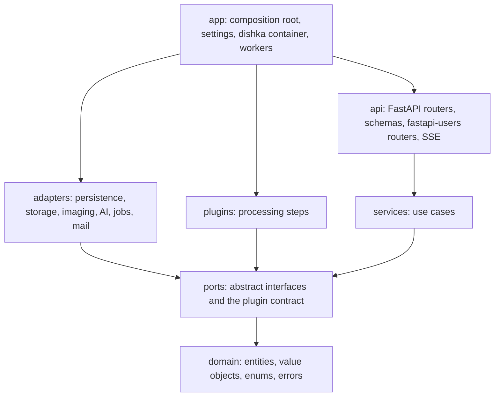

# BookReviver architecture

BookReviver turns scans of old printed books into corrected, re-typeset editions. One project is one book, owned by
an account. A book moves through stages (import, page split, geometry, cleanup, layout, background, recognition,
proofreading, typesetting), and every stage stays viewable and re-runnable at any time. Processing steps are plugins,
OCR engines and language models are interchangeable, and heavy work runs on workers that can live on other machines.

This document is the source of truth for structure and contracts. `CLAUDE.md` holds the working rules derived from
it. A change that contradicts this document updates the document in the same pull request.

## Principles

1. **Reuse before writing.** Every concern starts from the library, framework feature or community pattern that
   already solves it, found by reading its documentation and its bundled guides (FastAPI ships one in
   `fastapi/.agents/skills/fastapi/`). Code of our own covers only what is specific to BookReviver, and a pull request
   that writes something a dependency already offers says why.
2. **Ports and adapters.** The core (domain and services) defines abstract ports for everything outside it:
   persistence, file storage, mail, image processing, AI engines, jobs, events, time. Adapters implement the ports.
   The core imports no framework, no driver and no library that touches I/O.
3. **Every adapter is replaceable.** Swapping the database, the file store, the job broker, an OCR engine or an LLM
   provider means another adapter of the same port selected in the composition root. No service, route or service
   test changes.
4. **Substitutability is proven.** Each port has a contract test suite that runs against every one of its adapters,
   including the in-memory adapter the service tests use.
5. **Asynchronous end to end.** Every port method is `async`. The API, the database (SQLAlchemy 2.0 `AsyncSession`),
   file access and outbound HTTP (`httpx.AsyncClient`) never block the event loop. Blocking library calls go through
   Asyncer (`asyncify`) inside adapters, and heavy work runs only in background jobs.
6. **Extension without rewriting.** Processing steps, OCR engines, layout analysers and language models are plugins
   discovered through Python entry points. Adding one is a new package or module, not a change to the application.
7. **Dependencies point inwards only.** `import-linter` enforces the layer order and forbids infrastructure libraries
   in the core, as part of the pre-commit gate.

## Libraries

What each concern reuses, and therefore what we do not write ourselves.

| Concern                    | Library or feature                                              | Not written by us                                |
| -------------------------- | --------------------------------------------------------------- | ------------------------------------------------ |
| HTTP API                   | FastAPI: `Annotated` dependencies, router-level prefix and tags | Routing, validation, OpenAPI                     |
| Server-sent events         | FastAPI `EventSourceResponse`, `ServerSentEvent`                | Event stream formatting                          |
| Serving the frontend       | FastAPI `app.frontend()`                                        | Static files and client-side routing fallback    |
| Running                    | `fastapi dev`, `fastapi run`, `[tool.fastapi]` entrypoint       | Server bootstrap                                 |
| Dependency injection       | dishka, with its FastAPI and Taskiq integrations                | Container, scopes, wiring of workers             |
| Accounts                   | fastapi-users: register, verify, reset, cookie sessions, OAuth  | Auth flows, password hashing (pwdlib argon2)     |
| Social sign-in             | httpx-oauth: Google, Facebook, and X on its `BaseOAuth2`        | OAuth 2.0 protocol, PKCE, state                  |
| Rate limiting              | slowapi                                                         | Throttling of sign-in and registration           |
| CSRF                       | starlette-csrf                                                  | Double-submit cookie check                       |
| Persistence                | SQLAlchemy 2.0 async with advanced-alchemy repositories         | Generic CRUD, pagination, filters, column types  |
| Request validation         | Pydantic 2 models and constrained types, email-validator        | Parsing and checking input                       |
| Collection responses       | fastapi-pagination `Page[T]` and its `Params`                   | Paging schema and query parameters               |
| Error responses            | fastapi-problem (RFC 9457 problem details)                      | Error format, error schemas in OpenAPI           |
| Migrations                 | Alembic through advanced-alchemy's integration                  | Schema versioning                                |
| Secrets at rest            | advanced-alchemy `EncryptedString` with the Fernet backend      | Encryption of provider keys                      |
| Settings                   | pydantic-settings                                               | Environment and `.env` parsing                   |
| Background jobs            | Taskiq, in-process broker locally, Redis on a server            | Queueing, retries, worker processes              |
| Mail                       | aiosmtplib                                                      | SMTP                                             |
| PDF and images             | PyMuPDF, Pillow                                                 | Parsing and rasterising                          |
| Tiles                      | pyvips `dzsave` with the IIIF 3 layout                          | Tile pyramids and `info.json`                    |
| Image processing plugins   | OpenCV, scikit-image                                            | Geometry, filtering, morphology                  |
| Language and vision models | pydantic-ai                                                     | Provider clients, structured output validation   |
| Plugin discovery           | `importlib.metadata.entry_points`                               | Plugin loading                                   |

SQLAlchemy 2.0 is kept even though FastAPI's guide suggests SQLModel, because the persistence adapter is the only
place that sees the ORM and SQLAlchemy is the explicit project choice.

## Layers

| Package    | Owns                                                                   | May import                     |
| ---------- | ---------------------------------------------------------------------- | ------------------------------ |
| `app`      | Settings, adapter selection, plugin discovery, container, worker entry | every package below            |
| `api`      | HTTP routes, schemas, auth routers, SSE, error mapping                 | `services`, `domain`           |
| `adapters` | Implementations of ports over concrete technologies                    | `ports`, `domain`              |
| `plugins`  | Built-in processing plugins, written exactly like external ones        | `ports`, `domain`              |
| `services` | Use cases, business rules, authorisation                               | `ports`, `domain`              |
| `ports`    | Abstract base classes, the plugin contract                             | `domain`                       |
| `domain`   | Entities, value objects, enums with labels, the error hierarchy        | the standard library and attrs |

- `api`, `adapters` and `plugins` never import each other. Adapter families never import each other.
- `services` and `domain` may not import SQLAlchemy, advanced-alchemy, FastAPI, fastapi-users, Pydantic, Taskiq,
  pydantic-ai, PyMuPDF, Pillow, pyvips or OpenCV. The import-linter contract lists these packages explicitly.
- Accounts are the one place where a framework owns a table: fastapi-users keeps its user, OAuth account and access
  token tables inside the persistence adapter, and the core sees only an `AccountId` and the acting `Actor`.
- Background job entry points live in `app`: dishka resolves a service for the job, which calls one method.

## Domain

Pure Python with `attrs`. Entities are frozen and changed through `attrs.evolve`. Identifiers are `NewType`s, and
every closed set of values is a `StrEnum` carrying its own label.

| Area        | Types                                                                                      |
| ----------- | ------------------------------------------------------------------------------------------ |
| Accounts    | `AccountId`, `Actor`, `AccountSettings` (default engine and model per `AiTask`)            |
| Credentials | `ProviderCredential` with a masked secret, never printed or logged                         |
| Books       | `Project`, `BookDetails`, `SourceSummary`, `Page`, `PageFacts`                             |
| Processing  | `Stage`, `Recipe`, `Step`, `Variant`, `Artifact`, `ArtifactKind`, `Provenance`             |
| Edits       | `PageEdit` with geometry (`Rect`, `Quad`, `Mesh`, `Region` with `RegionKind`) or a mask    |
| Jobs        | `Job`, `JobKind`, `JobState`, `Progress`, `WorkerPool` (cpu, gpu, llm)                     |
| Queries     | `Slice[T]` (items and total), `SliceRequest` (offset and limit)                            |
| Errors      | `DomainError`, `NotFoundError`, `PermissionDeniedError`, `UploadRejectedError`, and others |

## Ports

Ports are abstract base classes, so every adapter names its parent explicitly and the type checkers verify it.

| Group       | Ports                                                                                  |
| ----------- | -------------------------------------------------------------------------------------- |
| Persistence | `Repository[EntityT, IdT]` and one child per aggregate, `UnitOfWork`                   |
| Storage     | `SourceStore` (stage, promote, discard an upload), `AssetStore` (derived files by key) |
| Mail        | `Mailer`                                                                               |
| Imaging     | `SourceInspector`, `PageRasterizer`, `Tiler`                                           |
| AI engines  | `TextRecognizer`, `LayoutAnalyzer`, `LanguageModel`, each with an engine catalogue     |
| Processing  | `Processor` (the plugin contract), `ProcessorCatalog`                                  |
| Runtime     | `JobQueue`, `EventPublisher`, `EventStream`, `Clock`                                   |

Every repository method takes the acting account, so a query can never cross account boundaries.

## Adapters

| Port family | Adapter now                                                     | Test adapter   | Later                  |
| ----------- | --------------------------------------------------------------- | -------------- | ---------------------- |
| Persistence | advanced-alchemy repositories on SQLAlchemy 2.0, aiosqlite      | in-memory      | PostgreSQL by URL only |
| Storage     | Local directory tree under `data/`                              | local, tmp dir | S3-compatible storage  |
| Mail        | Log mailer                                                      | recording fake | aiosmtplib over SMTP   |
| Imaging     | PyMuPDF and Pillow inspector and rasterizer, pyvips tiler       | fake images    | remote workers         |
| AI engines  | pydantic-ai for cloud and Ollama models, local Surya, Tesseract | scripted fakes | more providers         |
| Jobs        | Taskiq with the in-process broker                               | inline runner  | Taskiq with Redis      |
| Events      | In-process broadcast                                            | in-memory      | Redis pub/sub          |

The storage ports hand out local paths for the imaging libraries to read and write, so the storage test adapter is
the local one over a temporary directory rather than an in-memory store.

The persistence adapter keeps its table classes private and maps rows to domain entities in one mapper per entity.
Each port repository wraps an advanced-alchemy `SQLAlchemyAsyncRepository`, so generic queries come from the library
and each repository adds only its own. The database's checks surface as domain errors naming the keys involved: a
missing row or a missing parent row as `NotFoundError`, and a key already stored as `ConflictError`. The port states
both, so the in-memory adapter raises the same errors.
The library's audit columns are not used, because the domain sets `updated_at` through its `Clock`.
Tables are SQLAlchemy 2.0 declarative classes on advanced-alchemy's `DefaultBase`, which brings the shared metadata
and the portable `GUID`, `DateTimeUTC` and `JsonB` column types. Keys are declared on each table, and a project's
pages and jobs are relationships with `lazy="raise"`, so an `AsyncSession` never loads them implicitly, and with
`passive_deletes=True`, so their deletion is left to the `ON DELETE CASCADE` foreign keys.
Adapters are selected by settings read once in `app` (`BOOKREVIVER_DATABASE_URL`, `BOOKREVIVER_STORAGE`,
`BOOKREVIVER_JOB_BROKER` and so on).

## Services

| Service             | Use cases                                                                |
| ------------------- | ------------------------------------------------------------------------ |
| `AccountService`    | Account settings, provider credentials, default engines and models       |
| `ProjectService`    | List, create, read, edit the description, delete with all files          |
| `ImportService`     | Accept an upload and enqueue the import, run the import job step by step |
| `PageService`       | Page manifest, facts of one page, asset locations for the viewer         |
| `ProcessingService` | Recipes, previews, runs, variants, invalidation of later stages          |
| `EditService`       | Save and load manual page edits (frames, meshes, masks, regions)         |
| `JobService`        | Job state, cancellation, the event stream of a project                   |

Each service is a class constructed with the ports it needs and nothing else, and each checks that the acting
account may touch what it asks for. A use case that needs two services is composed by the caller. Registration,
sign-in, verification and password reset are fastapi-users routers, whose user manager hooks send mail through the
`Mailer` port.

## Accounts and security

- Sign-in with email and password (verified email required), or with Google, Facebook and X. A provider is enabled
  by configuring its client identifier and secret. X gives an email address only to apps approved for it, so an X
  sign-in without one asks the user to add and verify an email.
- fastapi-users cookie transport with its database strategy: an opaque token in an `HttpOnly`, `Secure`,
  `SameSite=Lax` cookie, stored server-side and revocable. No tokens in browser storage.
- starlette-csrf guards every mutating request, slowapi throttles sign-in, registration and reset.
- Provider API keys are stored with `EncryptedString`, returned only masked, and decrypted only by the adapter that
  calls the provider.

## Processing plugins

A processing step is a plugin implementing the `Processor` contract. Built-in plugins live in `plugins/` and are
registered through the entry point group `bookreviver.processors` that an external package also uses, so the two are
indistinguishable to the application.

| Part of a processor | Meaning                                                                           |
| ------------------- | --------------------------------------------------------------------------------- |
| `spec`              | Key (`cleanup.despeckle`), version, title, `Stage`, scope (page or whole book)    |
| inputs and outputs  | `ArtifactKind`s it reads and writes: page image, mask, regions, text              |
| parameters          | A JSON Schema, from which the interface builds the settings form                  |
| editor              | The `EditorKind` it needs (none, rect, quad, rotation, mesh, brush mask, regions) |
| worker pool         | cpu, gpu or llm, which routes its jobs to the right workers                       |
| `run`, `preview`    | Full run, and a fast run on a downscaled page for interactive tuning              |

- A **recipe** is the ordered list of steps with parameters for one stage, saved per project, with presets per
  account. A **variant** is an alternative recipe for the same stage, and one variant per stage feeds the next.
- Every result is an **artifact** with provenance: processor key and version, parameter hash, input artifacts. Their
  hash is the cache key, so re-running a recipe recomputes only changed steps, and changing a stage marks the
  artifacts of later stages stale.
- Manual edits are inputs: a frame or mesh drawn by the user becomes the geometry a crop or dewarp processor reads,
  and an eraser stroke becomes a mask.
- First plugins, in delivery order: page split, deskew, perspective crop by quad, dewarp by mesh, despeckle, eraser
  mask, layout regions (text versus illustration), background separation, background unification (white, aged paper
  texture, custom colour, consistent across the book), recognition, proofreading.
- Heavy plugins declare optional dependency groups (`bookreviver[cv]`, `[gpu]`, `[llm]`) installed only on the
  workers of their pool, and a worker loads only the plugins of its pool.

## AI engines and models

- `TextRecognizer`, `LayoutAnalyzer` and `LanguageModel` are ports. Each engine adapter describes itself in a
  catalogue: name, languages and scripts, models, whether it needs a key or a GPU.
- Cloud language and vision models go through pydantic-ai (OpenAI, Anthropic, Google, Mistral, Ollama), with typed,
  validated structured output for proofreading and layout answers.
- Local engines (Surya, Tesseract, olmOCR served by vLLM) run on gpu or cpu workers behind the same ports.
- The account settings page sets provider keys and the default engine and model per task (recognition, layout,
  proofreading). Every run can override the engine, the model and the prompt preset from the processing panel.

## Files and assets

Storage keys, not paths, cross the ports. The local adapter maps them to `data/`, and an S3 adapter maps them to a
bucket when workers run on other machines.

- `projects/<id>/incoming/` holds an upload until its analysis succeeds, then becomes `source/` in one rename.
- `projects/<id>/source/` holds the upload exactly as received, and is written once. A project with a source refuses
  another upload with a conflict before reading it: another book needs another project, or this project deleted with
  everything processed from it and created again.
- `projects/<id>/pages/<index>/` holds the imported page: `full.jpg` at native resolution, `thumb.jpg`, `iiif/`.
- `projects/<id>/artifacts/<hash>/` holds each processing result, with its own tiles when it is an image.

Nothing stored is ever replaced. Derived assets are regenerable under a new key, the next version or content hash,
which their URLs carry, so browsers cache them forever. Each is written under a hidden sibling name and moved onto
its key once complete, in a step the file system refuses when the key is taken, so a second writer gets a conflict
instead of replacing the first. Asset keys never name or hold a project's `source/` or `incoming/`, which belong to
the source store alone. A tile pyramid's `info.json`
carries as `id` the path of the IIIF route that serves it, passed to the `Tiler` port, because the viewer builds tile
URLs from it. The path has no scheme or host, so a change of domain, port or the address a device uses leaves the
cut pyramids valid. IIIF formally asks for an absolute URI there; OpenSeadragon resolves a path, and BookReviver
serves its own viewer, so the path is the deliberate choice.

## Import pipeline

1. `POST /api/v1/projects/{id}/source` streams the upload into `incoming/`, validates the file set, records a job and
   enqueues it. The response returns the job at once.
2. The job inspects the source, promotes it, replaces the page rows and fills only empty description fields. A
   job retried after a crash first deletes the project's `pages/` prefix, which removes the pages it cut and any
   partial files it left, and cuts every page again.
3. Every page gets `full.jpg`. A scanned PDF page whose content is one JPEG image is copied byte for byte. Anything
   else is rasterised once at its native resolution.
4. pyvips cuts `full.jpg` into an IIIF Image API 3 level 0 pyramid and a thumbnail, in a bounded pool. Each page is
   marked ready as soon as it is done, so the viewer shows the first pages while the rest are being cut.
5. Every step publishes progress events, which reach the browser over SSE.

## HTTP API

All endpoints live under `/api/v1`. The OpenAPI schema is generated from the routers and committed, and the frontend
client is generated from it.

| Area       | Endpoints                                                                                                 |
| ---------- | --------------------------------------------------------------------------------------------------------- |
| Auth       | fastapi-users routers under `/auth`: cookie login and logout, register, verify, reset, OAuth per provider |
| Account    | `GET /users/me`, `GET, PATCH /me/settings`, `GET, PUT, DELETE /me/credentials/{provider}`                 |
| Catalogue  | `GET /engines`, `GET /processors`                                                                         |
| Projects   | `GET, POST /projects`, `GET, PATCH, DELETE /projects/{id}`, `POST /projects/{id}/source`                  |
| Pages      | `GET /projects/{id}/pages`, `GET, PUT /projects/{id}/pages/{index}/edits/{stage}`                         |
| Processing | `GET, PUT /projects/{id}/stages/{stage}/recipe`, `POST .../preview`, `POST .../run`, `GET .../variants`   |
| Jobs       | `GET /jobs/{id}`, `DELETE /jobs/{id}`, `GET /projects/{id}/events` as SSE                                 |
| Images     | `GET /iiif/{asset}/...` as immutable static files                                                         |

On a server, a reverse proxy serves `/iiif` straight from disk or object storage, after an access check by the API.

### Request and response conventions

- Every input is a Pydantic model or a constrained `Annotated` type, validated by FastAPI before the route runs:
  bodies as models, query parameters as a model bound with `Annotated[Model, Query()]`, forms with `Form()`, headers
  with `Header()`, uploads as `UploadFile` with the file set checked by a model of their names and sizes. Handlers
  never parse or check raw input by hand.
- Constraints are declared, not coded: `Field` limits, `StringConstraints`, enums, `EmailStr`, `AnyHttpUrl`, and
  `field_validator` or `model_validator` only for a rule no declaration expresses. Reused constrained types (a title,
  a year, a page number) are defined once in `api/schemas/types.py`.
- Two base classes carry the shared configuration, so no schema repeats it. `RequestModel` forbids unknown fields and
  strips whitespace. `ResponseModel` reads attributes, so a schema is built straight from a domain object with
  `model_validate`.
- Following FastAPI's guide: no `...` as a default, no `RootModel` (an `Annotated` list with `Field` instead), and
  `Annotated` for every parameter and dependency.
- Pydantic stays at the edges: request and response schemas in `api`, settings in `app`. Domain invariants are
  `attrs` validators, so the core does not depend on Pydantic.
- Every route declares a typed Pydantic response. The shapes are the same everywhere: a single resource is its
  schema, a collection is fastapi-pagination's `Page[T]` (`items`, `total`, `page`, `size`, `pages`), and every error,
  including validation errors, is an RFC 9457 problem (`application/problem+json` with `type`, `title`, `status`,
  `detail`, `instance`) produced by fastapi-problem.
- Domain errors map to problems in one place, the exception handler registered in `app`. Routes never build error
  responses themselves.
- Status codes come from `fastapi.status` or `http.HTTPStatus`, never as number literals. A pre-commit `pygrep` hook
  rejects a literal status code in Python code.
- Services return domain objects and `Slice` results (items and total), and the API maps them to schemas and pages, so
  paging never reaches into a database query from a route.

## Frontend

- React 19, TypeScript, Vite, TanStack Router (file-based routes) and TanStack Query, shadcn/ui on Radix with
  Tailwind CSS 4, lucide icons. Biome lints and formats, `tsc --noEmit` checks types, Vitest runs unit tests,
  Playwright runs end-to-end tests. FastAPI serves the built application through `app.frontend()`.
- `src/api/` is generated by `@hey-api/openapi-ts`, including TanStack Query hooks, and is never edited by hand.
  `src/features/<area>/` holds one area each (auth, projects, settings, viewer, stages), and `src/shared/` holds UI
  components and hooks.
- Viewer state (page, spread, variant) lives in search params, so every view can be linked and reloaded. Server
  state lives in TanStack Query, and SSE events patch or invalidate the affected queries.
- The viewer is OpenSeadragon over IIIF tiles: one page or a two-page spread, page turns by buttons, keys, slider and
  go-to field, zoom by wheel, pinch, fit-to-width and fit-to-page, preloading of neighbouring pages, and a
  collapsible page panel.
- Editors are a react-konva layer kept in step with the OpenSeadragon viewport. An editor registry maps each
  `EditorKind` to a component: draggable frame, quad with corner handles, rotation handle, dewarp mesh, brush and
  eraser, region polygons labelled text or illustration.
- Processor parameter forms are rendered from their JSON Schema by react-jsonschema-form with its shadcn theme.
  Previews run on the visible page, and variants compare side by side or with a swipe.

## Testing

| Level          | What it proves                                       | Runs against                        |
| -------------- | ---------------------------------------------------- | ----------------------------------- |
| Domain         | Value rules and invariants                           | plain objects                       |
| Services       | Use cases, business rules, authorisation             | in-memory adapters of every port    |
| Port contracts | Every adapter behaves as its port promises           | each adapter, one shared test suite |
| Plugins        | A processor's output on reference pages              | the plugin with sample images       |
| API            | Routing, validation, auth, status codes, schemas     | the app with in-memory adapters     |
| End to end     | Sign in, upload a real PDF, tiles appear, pages turn | the full stack, Playwright          |

## Performance budgets

| Interaction                               | Budget on a laptop            |
| ----------------------------------------- | ----------------------------- |
| Turn to an already tiled page             | Under 150 ms to a sharp image |
| First page visible after an import starts | Under 3 s for a scanned PDF   |
| Interactive preview of a processing step  | Under 1 s on the visible page |
| Project list and page manifest requests   | Under 50 ms                   |
| Request handlers                          | Never block on CPU-bound work |

## Delivery plan

1. **Core, accounts, import.** Domain, ports, services, persistence and storage adapters with contract tests,
   accounts with email and Google (Facebook and X are configuration of the same adapter), the JSON API for projects
   and pages, the import job with tiling, SSE, import-linter. The Jinja interface is removed.
2. **Frontend shell.** Sign-in and registration, settings, project list and book details, upload with live progress.
3. **Viewer.** OpenSeadragon book viewer with spreads, navigation, zoom, preloading and the page panel.
4. **Processing framework.** Plugin contract and catalogue, recipes, artifacts, previews, variants, the editor layer,
   and the first geometry and cleanup plugins.
5. **Layout and background.** Region detection, background separation and unification.
6. **Recognition and models.** Engine catalogue, account model settings, OCR engines, proofreading with LLMs.
7. **Typesetting and export.** Later.

Steps 2 and 3 start in parallel once the OpenAPI schema of step 1 is committed, and develop against it.
